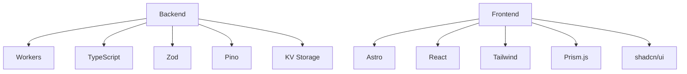
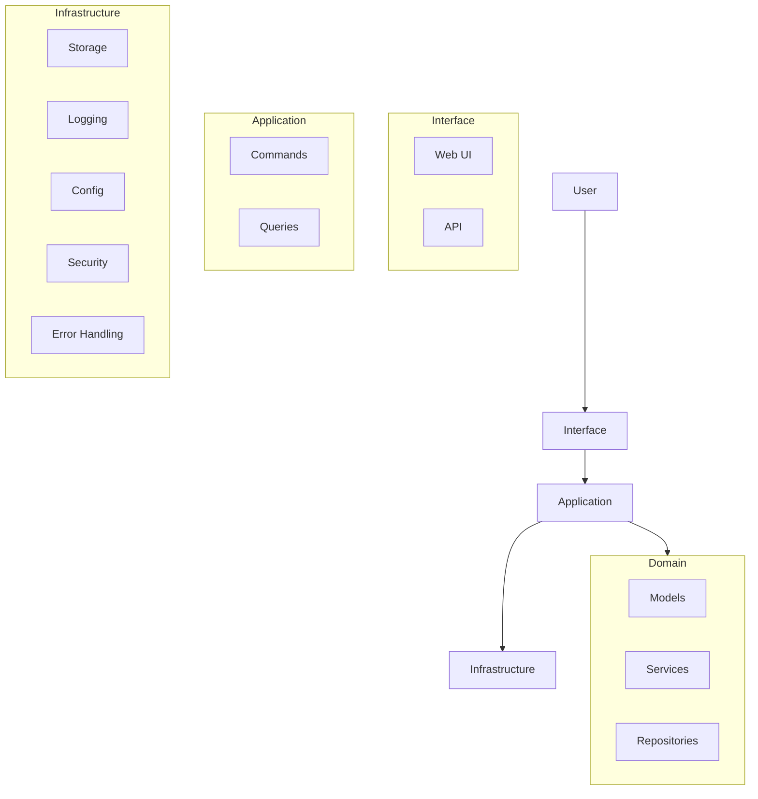
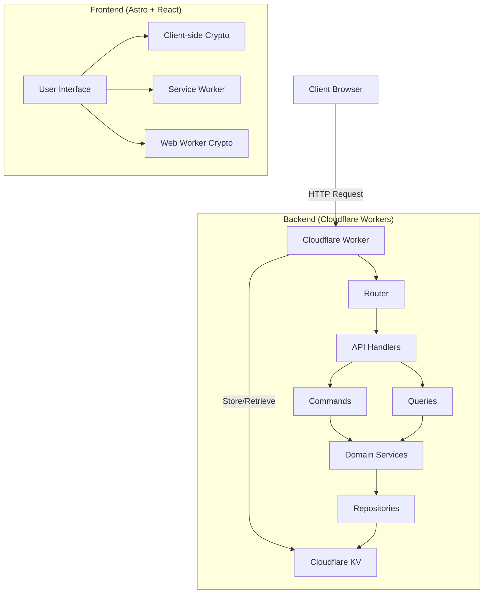
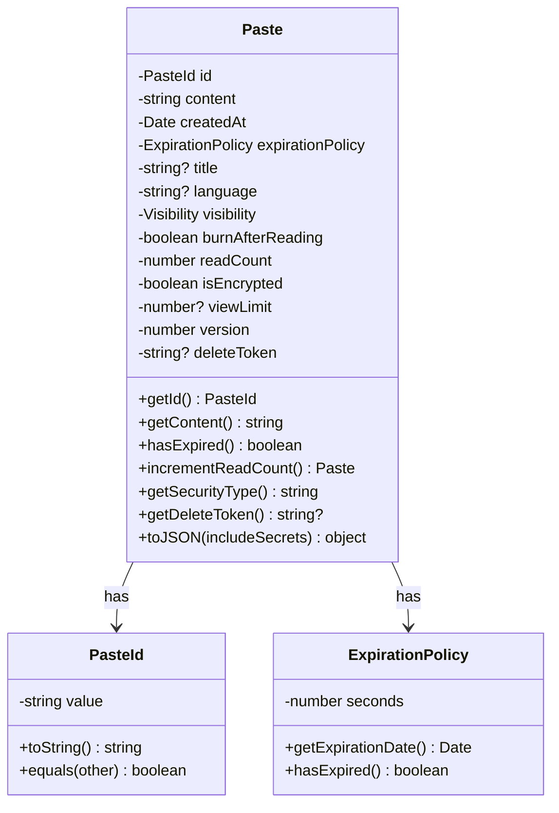
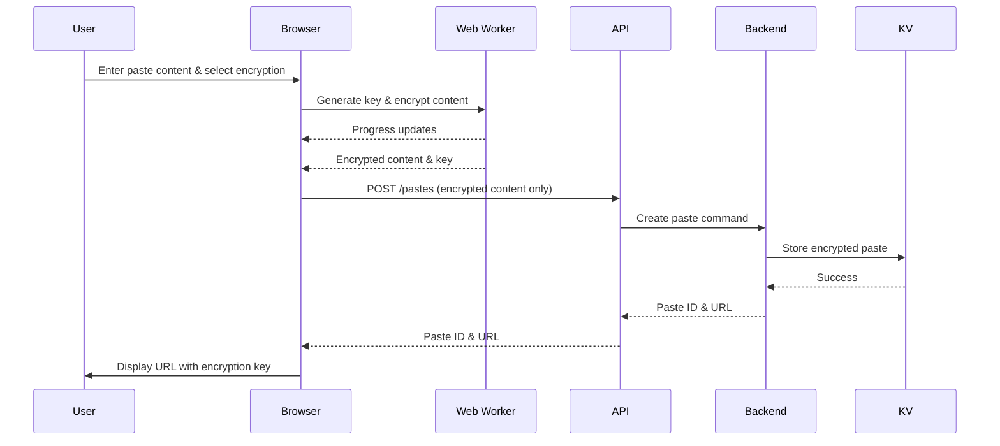
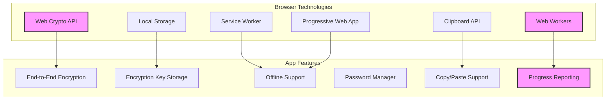
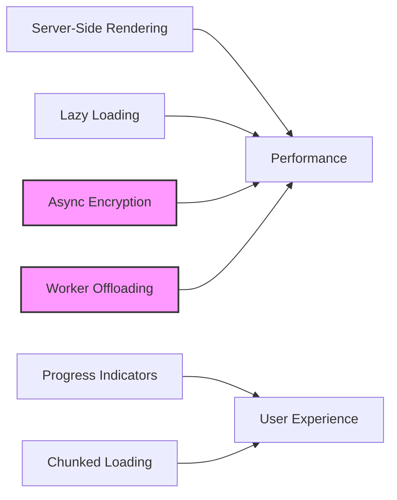
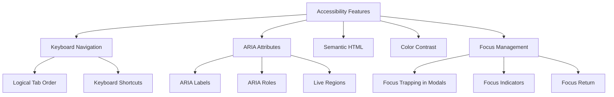
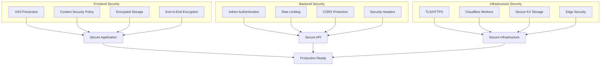

# Pasteriser

A modern, secure code sharing service built on Cloudflare Workers with Domain-Driven Design principles. Create and share code snippets with syntax highlighting, password protection, and burn-after-reading functionality.

## Features

- **Advanced Code Sharing**
  - Create and view text/code pastes with rich formatting
  - Syntax highlighting for 40+ programming languages with Prism.js
  - Custom expiration times (1 hour to 1 year)
  - Public and private visibility options
  - View limits with automatic deletion
  
- **Security & Privacy**
  - End-to-end encryption for sensitive content
  - Password protection with strong key derivation
  - "Burn after reading" self-destructing pastes
  - Client-side encryption with secure key sharing
  - Enterprise-grade security with comprehensive protections
  - Encrypted local storage for sensitive data
  - Rate limiting with bypass prevention
  - Admin endpoint authentication
  - XSS prevention and CSP headers
  - Private pastes hidden from listings
  
- **Enhanced User Experience**
  - Modern UI with dark mode support
  - Toast notifications for user feedback
  - Improved modal confirmations
  - Line numbers for code readability
  - One-click copy to clipboard
  - Raw view for easy embedding
  - Mobile-responsive design
  - Progressive loading for large pastes

- **Progressive Web App**
  - Installable on desktop and mobile devices
  - Offline support with custom offline page
  - Optimized for mobile experience
  - Service worker for improved performance

- **Robust Error Handling**
  - Comprehensive error categorization
  - User-friendly error messages
  - Error recovery mechanisms
  - Detailed error logging with privacy safeguards
  - React error boundaries for component-level errors

## Technology Stack



- **Backend**
  - Cloudflare Workers: Serverless edge computing
  - TypeScript: Strongly typed JavaScript
  - Zod: Runtime schema validation
  - Pino: Structured logging
  - Cloudflare KV: Key-value storage

- **Frontend**
  - Astro: Static site generation
  - React: Interactive UI components
  - Tailwind CSS: Utility-first styling
  - Prism.js: Advanced syntax highlighting
  - shadcn/ui: Accessible component library
  - TweetNaCl.js: Cryptographic operations

## Architecture

This project follows Domain-Driven Design principles with a clean architecture approach:



### Architectural Layers

The application is structured in four primary layers following Domain-Driven Design principles:

1. **Domain Layer**: Core business logic and entities
   - Paste model and value objects
   - Repository interfaces
   - Domain services for core business logic

2. **Application Layer**: Use cases and orchestration
   - Command handlers (create/delete pastes)
   - Query handlers (retrieve pastes)
   - Factories for domain object creation

3. **Infrastructure Layer**: Technical capabilities
   - KV storage implementation
   - Logging services
   - Security services
   - Error handling
   - Configuration management

4. **Interface Layer**: User interfaces and APIs
   - API endpoints
   - Astro pages
   - React components
   - UI utilities

### System Overview



### Core Domain Model

The application is centered around the **Paste** concept - a text/code snippet with metadata and security features.



## End-to-End Encryption

Pasteriser implements true end-to-end encryption (E2EE), meaning that all encryption and decryption happens in the user's browser, not on the server. This provides strong privacy guarantees:

1. The server never sees the unencrypted content
2. The server never receives the encryption password or key
3. Only users with the correct password or full URL (containing the key) can decrypt the content



### Security Methods

When creating a paste, users can choose between two security methods:

1. **Password Protection (E2EE)**:
   - A user-supplied password is used to derive an encryption key via PBKDF2
   - A unique random salt is generated for each paste
   - The content is encrypted with the derived key
   - The encrypted content includes the salt so it can be decrypted later
   - The server never receives the password

2. **Key Protection (E2EE)**:
   - A random 32-byte encryption key is generated
   - The content is encrypted with this key
   - The key is appended to the URL fragment (after the # symbol)
   - URL fragments are never sent to the server
   - Only people with the complete URL can decrypt the content

### Encryption Implementation

- **Symmetric Encryption**: XSalsa20-Poly1305 via TweetNaCl.js (`nacl.secretbox`)
- **Key Derivation**: PBKDF2 via Web Crypto API with 300,000 iterations for password-based encryption
- **Random Generation**: Cryptographically secure random number generation for keys, nonces, and salts

### Web Worker Optimization

For improved performance, cryptographic operations use Web Workers:

- Prevents UI freezing during heavy cryptographic operations
- Provides responsive feedback via progress reporting
- Optimizes CPU utilization on multi-core systems
- Selective offloading: Only pastes larger than 10KB are processed in the worker
- Resource management: Workers are terminated after 60 seconds of inactivity



## Performance Optimizations

Pasteriser implements several performance optimizations:



1. **Astro Partial Hydration**: Only hydrate interactive components
2. **Web Worker Offloading**: Move CPU-intensive crypto to background threads
3. **Chunked Rendering**: Progressive loading for large pastes
4. **Selective Encryption**: Only use workers for data >10KB
5. **Service Worker Caching**: Offline access and faster repeat visits
6. **React Hydration Optimization**: Delayed React initialization

## API Reference

### API Endpoints

The API is RESTful and follows standard HTTP conventions.

#### Create a Paste

**Endpoint:** `POST /pastes`

**Request Body:**
```json
{
  "content": "string",
  "title": "string",
  "language": "string",
  "expiration": 86400,
  "visibility": "public",
  "password": "string",
  "burnAfterReading": false,
  "isEncrypted": false,
  "viewLimit": 10,
  "version": 2
}
```

| Field | Type | Required | Description |
|-------|------|----------|-------------|
| `content` | string | Yes | Paste content (max 25 MiB) |
| `title` | string | No | Title (max 100 chars) |
| `language` | string | No | Syntax highlighting language |
| `expiration` | number | No | TTL in seconds (default: 86400) |
| `visibility` | string | No | `"public"` or `"private"` (default: `"public"`) |
| `password` | string | No | Triggers client-side E2E encryption |
| `burnAfterReading` | boolean | No | Self-destruct after first view |
| `isEncrypted` | boolean | No | Whether content is already E2E encrypted |
| `viewLimit` | number | No | Max views before auto-deletion (1-100) |
| `version` | number | No | Encryption version (0=plaintext, 2=client-side E2E) |

**Response:**
```json
{
  "id": "string",
  "url": "string",
  "expiresAt": "string",
  "deleteToken": "string"
}
```

> **Important:** The `deleteToken` is returned only at creation time. Store it securely — it is the only way to authorize deletion of the paste.

#### Get a Paste

**Endpoint:** `GET /pastes/:id`

Set `Accept: application/json` to receive JSON. HTML requests are served the Astro viewer page.

**Response:**
```json
{
  "id": "string",
  "content": "string",
  "title": "string",
  "language": "string",
  "createdAt": "string",
  "expiresAt": "string",
  "visibility": "public",
  "burnAfterReading": false,
  "readCount": 1,
  "isEncrypted": false,
  "hasViewLimit": false,
  "viewLimit": null,
  "remainingViews": null,
  "version": 0,
  "securityType": "Public"
}
```

#### Get Raw Paste Content

**Endpoint:** `GET /pastes/raw/:id`

Returns the raw paste content as `text/plain`.

#### Delete a Paste

**Endpoint:** `DELETE /pastes/:id/delete`

Deletion requires the `deleteToken` that was returned when the paste was created.

**Via query parameter:**
```bash
curl -X DELETE "https://paste.erfi.dev/pastes/PASTE_ID/delete?token=DELETE_TOKEN"
```

**Via JSON body:**
```bash
curl -X DELETE "https://paste.erfi.dev/pastes/PASTE_ID/delete" \
  -H "Content-Type: application/json" \
  -d '{"token": "DELETE_TOKEN"}'
```

**Response (success):**
```json
{
  "success": true,
  "message": "Paste deleted successfully"
}
```

**Response (unauthorized):**
```json
{
  "error": {
    "code": "unauthorized",
    "message": "Unauthorized"
  }
}
```

### Rate Limiting

Rate limiting is applied to protect the service:

- General rate limit: 60 requests per minute
- Paste creation: 10 pastes per minute
- Rate limit data cached in-memory with bounded eviction (max 1000 entries) and persisted to KV

## Getting Started

### Prerequisites

- Node.js (v16+)
- npm or yarn
- Wrangler CLI (`npm install -g wrangler`)
- Cloudflare account

### Installation

```bash
# Clone the repository
git clone https://github.com/username/pastebin.git
cd pastebin

# Install main project dependencies
npm install

# Install Astro UI dependencies
cd astro
npm install
cd ..
```

### Security Configuration

Before deployment, configure these security settings:

#### Required Environment Variables

```bash
# Generate a strong admin API key (required)
ADMIN_API_KEY=$(openssl rand -hex 32)
```

**Security Best Practice**: Use Wrangler secrets for sensitive values:

```bash
# Add ADMIN_API_KEY as a secret (recommended for production)
wrangler secret put ADMIN_API_KEY
# When prompted, paste your generated key

# For development/staging, you can use vars in wrangler.jsonc:
```

```jsonc
{
  "vars": {
    "ADMIN_API_KEY": "your-dev-key-here"
  },
  "env": {
    "production": {
      // Use secrets for production, not vars
    }
  }
}
```

**CORS Configuration**: Configure allowed origins via the config service. The system will:
- Mirror the `Origin` header when `*` is in the allowlist (supports credentials)
- Fall back to `*` only when no Origin header is present
- Validate against explicit allowlist when configured

#### Admin API Usage

Access administrative endpoints with Bearer token authentication:

```bash
# View analytics
curl -H "Authorization: Bearer YOUR_API_KEY" https://yourdomain.com/api/analytics

# View logs  
curl -H "Authorization: Bearer YOUR_API_KEY" https://yourdomain.com/api/logs

# Manage webhooks
curl -H "Authorization: Bearer YOUR_API_KEY" https://yourdomain.com/api/webhooks
```

### Configure Cloudflare KV Namespaces

Create KV namespaces for storing pastes, logs, rate limiting, analytics, and webhooks:

```bash
# Required: Main paste storage
wrangler kv:namespace create PASTES

# Required: Rate limiting
wrangler kv:namespace create PASTE_RL

# Required: Application logs
wrangler kv:namespace create PASTE_LOGS

# Optional but recommended: Analytics data
wrangler kv:namespace create ANALYTICS

# Optional: Webhook configurations
wrangler kv:namespace create WEBHOOKS
```

Update the `wrangler.jsonc` file with your KV namespace IDs:

```jsonc
{
  // ...
  "kv_namespaces": [
    {
      "binding": "PASTES",
      "id": "your-pastes-namespace-id"
    },
    {
      "binding": "PASTE_RL",
      "id": "your-ratelimit-namespace-id"
    },
    {
      "binding": "PASTE_LOGS",
      "id": "your-logs-namespace-id"
    },
    {
      "binding": "ANALYTICS",
      "id": "your-analytics-namespace-id"
    },
    {
      "binding": "WEBHOOKS",
      "id": "your-webhooks-namespace-id"
    }
  ],
  // ...
}
```

**Note**: If `ANALYTICS` or `WEBHOOKS` namespaces are not configured, the application will gracefully degrade:
- Without `ANALYTICS`: Analytics tracking will be skipped with a warning log
- Without `WEBHOOKS`: Webhook features will be disabled automatically

### Development

Start the development server with both the Worker API and Astro UI:

```bash
npm run dev:all
```

This will:
- Start the Astro UI at http://localhost:3000
- Start the Cloudflare Worker at http://localhost:8787

### Building for Production

Build the project for production:

```bash
npm run build
```

### Deployment

Deploy to Cloudflare:

```bash
npm run deploy
```

## Project Commands

### Development
- `npm run dev:all` - Start both UI and Worker development servers
- `npm run dev:ui` - Start only the Astro UI development server  
- `npm run dev` - Start only the Cloudflare Worker

### Build & Deploy
- `npm run build` - Build both UI and Worker for production
- `npm run deploy` - Deploy to Cloudflare Workers

### Testing & Quality Assurance
- `npm run test` - Run tests
- `npm run test:watch` - Run tests in watch mode
- `npm run lint` - Run ESLint
- `npm run check` - Run TypeScript typechecking

### Security
- Generate admin API key: `openssl rand -hex 32`
- Test admin endpoints: `curl -H "Authorization: Bearer YOUR_KEY" /api/analytics`
- Review security config: See [SECURITY.md](./SECURITY.md) for complete guide

## Testing End-to-End Encryption

This section outlines how to test the encryption features in the application.

### Test Scenarios

#### Creating Pastes with Different Security Methods

1. **No Encryption (Plaintext)**
   - Create a paste with "None (Plaintext)" security option
   - Verify the paste is viewable without encryption indicators
   - Content is sent to server in plaintext

2. **Key-Based Encryption**
   - Create a paste with "Key Protection (E2EE)" security option
   - Verify URL contains a fragment identifier (#key=...)
   - Only encrypted content is sent to server

3. **Password-Based Encryption**
   - Create a paste with "Password Protection (E2EE)" option
   - Enter password and observe strength meter
   - Verify URL doesn't contain the encryption key
   - Password is never sent to the server

#### Viewing and Decrypting Pastes

1. **Viewing Key-Encrypted Paste**
   - With complete URL: Content should automatically decrypt
   - With incomplete URL: Encryption warning should be displayed

2. **Viewing Password-Encrypted Paste**
   - Password form should be displayed
   - Correct password should decrypt content
   - Incorrect password should show error message

#### Browser Integration Features

1. **Password Manager Integration**
   - Password fields should work with browser password managers
   - Password should be savable and auto-fillable

2. **Copy to Clipboard Functions**
   - URL with encryption key should copy correctly
   - Toast notifications should confirm successful copying

3. **Key Storage**
   - "Save Key" button should store key in localStorage
   - Revisiting without key in URL should offer to use saved key

### Web Worker Performance Testing

1. **Worker-Based Encryption/Decryption**
   - Create a paste with large content (500KB+)
   - Verify separate Web Worker thread in performance profile
   - UI should remain responsive during encryption

2. **Progress Reporting**
   - Large content should show progress bars
   - Progress percentage should update incrementally
   - UI should remain responsive during processing

3. **Worker Fallback Testing**
   - Disable Web Workers in browser
   - Verify encryption still works on main thread
   - No errors should be shown to the user

4. **Long Content and Special Characters**
   - Very large pastes (1MB+) should work correctly
   - Unicode and special characters should be preserved
   - Encrypted content should decrypt correctly

### Security Testing Considerations

- Server should never receive plaintext for encrypted pastes
- Server should never receive encryption keys or passwords
- Decryption should always happen entirely client-side
- Encryption keys should be properly secured in URL fragments
- Admin endpoints should require proper authentication
- CORS should be properly restricted in production
- Debug information should not leak in production builds

## Accessibility

Pasteriser implements several accessibility features to ensure usability for all users:



### Core Accessibility Features

1. **Semantic HTML Structure**:
   - Using appropriate HTML elements
   - Properly structured headings
   - Meaningful form labels and field associations
   - Landmark regions for navigation

2. **ARIA Implementation**:
   - ARIA roles for complex components
   - ARIA live regions for dynamic content changes
   - ARIA labels and descriptions for clarity
   - Status indicators for operations in progress

3. **Keyboard Navigation**:
   - All interactive elements are keyboard accessible
   - Custom keyboard shortcuts for common actions
   - Focus management for modal dialogs
   - Skip links for keyboard users

4. **Visual Design Considerations**:
   - High contrast color options
   - Text resizing without breaking layouts
   - Visible focus indicators that meet WCAG standards
   - Non-color-dependent status indicators

## Future Enhancements

1. **Enhanced Security Features**
   - Two-factor authentication for admin operations
   - Content scanning for harmful material
   - Advanced rate limiting strategies
   - Improved encryption key management

2. **User Experience Improvements**
   - User accounts (optional)
   - Paste collections and organization
   - Enhanced code editor with more features
   - Collaborative editing capabilities
   - Improved mobile experience

3. **Performance Optimizations**
   - Implement code splitting for faster loading
   - Add progressive enhancement for core functionality
   - Optimize large file handling
   - Enhance caching strategies

4. **Integrations**
   - GitHub Gist import/export
   - VS Code extension
   - Webhook notifications
   - Integration with CI/CD systems

## Browser Compatibility

Feature support varies by browser with appropriate fallbacks:

| Feature | Chrome/Edge (60+) | Firefox (55+) | Safari (11+) | Opera (47+) | Fallback Behavior |
|---------|------------------|--------------|-------------|------------|-------------------|
| Web Workers | ✅ | ✅ | ✅ | ✅ | Main thread processing |
| Web Crypto API | ✅ | ✅ | ✅ | ✅ | Alert for unsupported browser |
| Service Workers | ✅ | ✅ | ✅* | ✅ | Standard page loading |
| Password Manager | ✅ | ✅ | ✅ | ✅ | Manual password entry |
| LocalStorage | ✅ | ✅ | ✅** | ✅ | No key persistence |
| Clipboard API | ✅ | ✅ | ✅ | ✅ | Manual copy instructions |

*Safari has some limitations with Service Workers in private browsing mode.
**Safari in private browsing mode limits localStorage.

## Security

Pasteriser implements comprehensive security measures to protect user data and system integrity. For detailed security information, see [SECURITY.md](./SECURITY.md).

### Security Highlights

#### Authentication & Authorization ✅
- **Admin API Protection**: All administrative endpoints (`/api/analytics`, `/api/logs`, `/api/webhooks`) require Bearer token authentication
- **Timing-Safe Validation**: Uses SHA-256 hashing with constant-time comparison to prevent both timing and length-oracle attacks
- **Paste Deletion Authorization**: Delete operations require a `deleteToken` issued at creation time
- **Proper Error Handling**: Returns standard HTTP 401/403 responses with appropriate headers

#### Cross-Site Scripting (XSS) Prevention ✅
- **Complete HTML Injection Prevention**: All user content uses `textContent` instead of `innerHTML`
- **Safe DOM Creation**: Programmatic element creation throughout the application
- **No Template Interpolation**: Zero template string interpolation with user data

#### Cross-Origin Resource Sharing (CORS) Security ✅
- **Strict Origin Validation**: Explicit allowlist-based CORS configuration
- **No Wildcard Origins**: Wildcard CORS completely eliminated in production
- **Development Fallback**: Localhost-only origins allowed in development

#### Content Security Policy (CSP) ✅
- **Comprehensive Directives**: Covers all resource types with minimal permissions
- **No unsafe-eval**: `script-src` restricted to `'self'` only; Web Workers load via `worker-src blob:`
- **No Inline Scripts**: Prevents injection of arbitrary JavaScript

#### Rate Limiting Security ✅
- **Path-Based Validation**: Prevents bypass via crafted file extensions
- **Static Asset Protection**: Legitimate assets exempt without security holes
- **Granular Limits**: Different limits for different operation types
- **Bounded Memory**: In-memory cache capped at 1000 entries with automatic eviction of expired entries

#### Secure Data Storage ✅
- **Encrypted localStorage**: AES-GCM encryption for all sensitive data
- **Master Key Management**: Per-session master keys with secure generation
- **Backward Compatibility**: Graceful fallback to plaintext storage when needed

#### Information Disclosure Prevention ✅
- **Production-Safe Logging**: Debug information only shown in development
- **Generic Error Messages**: Stack traces and sensitive details hidden in production
- **Development Detection**: Hostname-based environment detection

#### Security Headers ✅
- **X-Content-Type-Options**: Prevents MIME type sniffing
- **X-Frame-Options**: Clickjacking protection
- **Strict-Transport-Security**: HTTPS enforcement with preload
- **Referrer-Policy**: Controlled referrer information leakage
- **Permissions-Policy**: Blocks unnecessary browser APIs

### Security Architecture



### Security Compliance

- **OWASP Top 10 2021**: Addresses all major web application security risks
- **Content Security Policy Level 3**: Modern CSP implementation
- **Secure Headers**: Implements security.txt recommendations
- **Timing Attack Resistance**: Constant-time operations for sensitive comparisons

### Responsible Disclosure

Security vulnerabilities should be reported responsibly:

1. **Do not** create public issues for security vulnerabilities
2. Contact maintainers through private channels
3. Provide detailed vulnerability information
4. Allow reasonable time for fixes before public disclosure

For more detailed security information, configuration guides, and security checklist, see [SECURITY.md](./SECURITY.md).

## Current Deployment Status

**Live Version**: `272135c9-8306-4a51-8389-94a5e713907f` (deployed Dec 6, 2025)
**Domain**: https://paste.erfi.dev
**Worker Startup Time**: 13 ms
**Deployment Size**: 555.47 KiB (gzipped: 87.37 KiB)

### Active KV Namespaces

All 5 KV namespaces are configured and operational:

| Binding | Purpose | Status |
|---------|---------|--------|
| PASTES | Main paste storage | ✅ Active |
| PASTE_LOGS | Application logs | ✅ Active |
| PASTE_RL | Rate limiting | ✅ Active |
| ANALYTICS | Analytics data (30-day retention) | ✅ Active |
| WEBHOOKS | Webhook configurations | ✅ Active |

## Recent Updates

### February 2026 - Security & Code Quality Audit

A comprehensive code review identified and fixed 16 issues across security, correctness, and performance:

#### Critical Fixes
- **Burn-After-Reading Fix**: Creating a paste no longer increments its read count (previously, fetching the paste for webhook payload triggered a view, causing burn-after-reading pastes to self-destruct on creation)
- **View Limit Deletion**: Replaced unreliable `setTimeout` with synchronous deletion — Cloudflare Workers may terminate before deferred callbacks fire
- **Paste Deletion Authorization**: Pastes now require a `deleteToken` (returned at creation time) to delete. Previously, anyone who knew a paste ID could delete it

#### Security Hardening
- **Webhook Secret Redaction**: Webhook endpoints no longer expose their `secret` field in API responses
- **SSRF Prevention**: Webhook registration now validates URLs — blocks private IPs, loopback addresses, non-HTTPS, and internal hostnames
- **Timing-Safe Auth**: Admin auth now hashes both inputs with SHA-256 before constant-time comparison, eliminating the length-oracle side channel
- **CSP Tightened**: Removed `unsafe-eval` from `script-src`; Web Workers use `worker-src blob:` instead

#### Bug Fixes
- **AppError Misuse**: Fixed all `AppError` constructor calls in `webhookService.ts` where arguments were swapped (`message` passed as `code`, string `'500'` passed as `message`)
- **Error Handling Consistency**: API handlers now throw `AppError` and let the global error handler produce responses, eliminating ~100 lines of duplicate try/catch blocks

#### Performance Improvements
- **N+1 Query Fix**: Recent pastes are now fetched in parallel (`Promise.all`) instead of sequentially; paste IDs are extracted from KV key names instead of doing extra reads
- **Rate Limiter Bounded Cache**: In-memory rate limit cache is now capped at 1000 entries with automatic eviction of expired entries, preventing unbounded memory growth

#### Code Quality
- **Static Imports**: All dynamic `await import()` calls replaced with static imports at the module level
- **Admin Route Helper**: Extracted `adminRoute()` helper to deduplicate admin auth checks (was copy-pasted 4 times)
- **Config Consistency**: Paste max size in config and Zod schema now both set to 25 MiB (matching Cloudflare KV limit)
- **Stale Comment Cleanup**: Removed obsolete Phase 4 / password-hash comments throughout the codebase
- **Unused Code Removal**: Removed dead `handleRateLimit` method from `ApiMiddleware`

### December 2025 - Critical Fixes & Improvements

#### View Limits & Burn After Reading Enhancement
The view limit system has been completely rewritten for correctness:
- **Incremental Counting**: Read count now increments on every view, not just the last one
- **Pre-check Validation**: System validates view limit before serving content
- **Proper Deletion**: Burn-after-reading and view-limit-reached pastes are properly deleted

#### CORS Security Improvements
- **Origin Mirroring**: When using wildcard allowlist, mirrors Origin header for credentials
- **Consistent Headers**: CORS headers applied to all responses, not just preflight
- **Flexible Configuration**: Supports both wildcard and explicit origin allowlists

#### Analytics Infrastructure
- **Separated Concerns**: Analytics data now in dedicated `ANALYTICS` KV namespace
- **Graceful Degradation**: Works without ANALYTICS namespace (logs warning)
- **30-Day Retention**: Automatic expiration of analytics events

#### Admin Authentication Improvements
- **Environment Variables**: Reads ADMIN_API_KEY from worker environment
- **Type Safety**: Full TypeScript support for admin credentials

#### Webhook Auto-Configuration
- **Smart Detection**: Automatically enables when WEBHOOKS KV exists
- **Explicit Control**: Can be manually disabled via config if needed

For detailed technical information about these changes, see [CHANGELOG.md](./CHANGELOG.md).

### Verification & Testing

```bash
# 1. Create a paste and note the deleteToken
curl -X POST https://paste.erfi.dev/pastes \
  -H "Content-Type: application/json" \
  -d '{"content": "test", "viewLimit": 2}'
# Response includes: { "id": "...", "deleteToken": "..." }

# 2. Delete a paste (requires token)
curl -X DELETE "https://paste.erfi.dev/pastes/PASTE_ID/delete?token=DELETE_TOKEN"

# 3. Test admin endpoints (requires ADMIN_API_KEY)
curl -H "Authorization: Bearer YOUR_KEY" https://paste.erfi.dev/api/analytics

# 4. Test burn after reading
curl -X POST https://paste.erfi.dev/pastes \
  -H "Content-Type: application/json" \
  -d '{"content": "secret", "burnAfterReading": true}'
# View once, then second view returns 404
```

## License

[MIT License](./LICENSE) © 2025 Erfi Anugrah