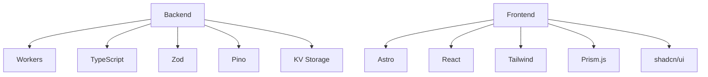
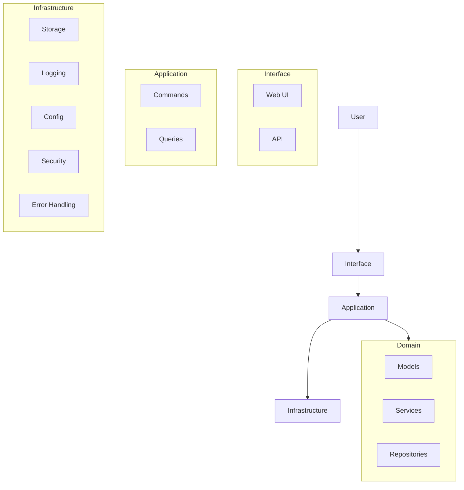

# Pasteriser

A modern, secure code sharing service built on Cloudflare Workers with Domain-Driven Design principles. Create and share code snippets with syntax highlighting, password protection, and burn-after-reading functionality.

## Features

- **Advanced Code Sharing**
  - Create and view text/code pastes with rich formatting
  - Syntax highlighting for 40+ programming languages with Prism.js
  - Custom expiration times (1 hour to 1 year)
  - Public and private visibility options
  - View limits with automatic deletion
  
- **Security & Privacy**
  - End-to-end encryption for sensitive content
  - Password protection with strong key derivation
  - "Burn after reading" self-destructing pastes
  - Client-side encryption with secure key sharing
  - Rate limiting and content validation
  - Private pastes hidden from listings
  
- **Enhanced User Experience**
  - Modern UI with dark mode support
  - Toast notifications for user feedback
  - Improved modal confirmations
  - Line numbers for code readability
  - One-click copy to clipboard
  - Raw view for easy embedding
  - Mobile-responsive design
  - Progressive loading for large pastes

- **Progressive Web App**
  - Installable on desktop and mobile devices
  - Offline support with custom offline page
  - Optimized for mobile experience
  - Service worker for improved performance

- **Robust Error Handling**
  - Comprehensive error categorization
  - User-friendly error messages
  - Error recovery mechanisms
  - Detailed error logging with privacy safeguards
  - React error boundaries for component-level errors

## Technology Stack



- **Backend**
  - Cloudflare Workers: Serverless edge computing
  - TypeScript: Strongly typed JavaScript
  - Zod: Runtime schema validation
  - Pino: Structured logging
  - Cloudflare KV: Key-value storage

- **Frontend**
  - Astro: Static site generation
  - React: Interactive UI components
  - Tailwind CSS: Utility-first styling
  - Prism.js: Advanced syntax highlighting
  - shadcn/ui: Accessible component library
  - TweetNaCl.js: Cryptographic operations

## Architecture

This project follows Domain-Driven Design principles with a clean architecture approach:



- **Domain Layer**: Core business logic and entities (Paste model, repositories)
- **Application Layer**: Use cases and application orchestration (commands/queries)
- **Infrastructure Layer**: Technical capabilities (storage, logging, caching, error handling)
- **Interface Layer**: User interfaces (API endpoints, Astro pages, React components)

## Getting Started

### Prerequisites

- Node.js (v18+)
- npm or yarn
- Wrangler CLI (`npm install -g wrangler`)
- Cloudflare account

### Installation

```bash
# Clone the repository
git clone https://github.com/username/pastebin.git
cd pastebin

# Install dependencies
npm install
```

### Development

The project includes several npm scripts to help with development:

```bash
# Start development server for backend
npm run dev

# Start UI development server
npm run dev:ui

# Start both backend and UI servers concurrently
npm run dev:all

# Run TypeScript type checking
npm run check

# Run tests
npm test
```

### Configuration

The application is configured through `wrangler.jsonc`. You need to:

1. Create a KV namespace for paste storage
2. Update the `wrangler.jsonc` with your KV namespace ID
3. Configure any custom domains if needed

### Deployment

Deploy to Cloudflare Workers:

```bash
# Deploy to staging
npm run deploy:staging

# Deploy to production
npm run deploy:prod
```

## Recent Improvements

### Error Handling System

We've implemented a comprehensive error handling system that provides:

- **Standardized Error Types**: Hierarchical error classes for consistent error handling
- **Error Categorization**: Automatic categorization by error type (network, crypto, validation, etc.)
- **User-Friendly Messages**: Context-aware error messages that guide users
- **React Error Hooks**: Custom React hooks for component-level error handling
- **Error Boundaries**: React error boundaries to prevent component crashes
- **Privacy-Aware Logging**: Error logging that redacts sensitive information

### React Component Structure

- **Reusable UI Components**: Extended shadcn/ui with custom components
- **Form Validation**: Standardized validation rules and error display
- **Component Hooks**: Custom hooks for common operations (async, timeout, etc.)
- **Error Displays**: Consistent error presentation across the application

## Improvement Roadmap

### 1. Input Validation

- Create centralized validation utility
- Implement field-specific validation
- Add real-time validation feedback
- Enhance password strength validation
- Add Base64 and URL validation for cryptographic keys

### 2. Accessibility

- Implement WCAG 2.1 AA compliance
- Add keyboard navigation support
- Enhance screen reader experience
- Improve focus management
- Add proper ARIA attributes
- Implement skip links

### 3. UI Testing

- Set up Jest and React Testing Library
- Create component tests for core UI
- Implement visual regression testing
- Add accessibility testing
- Test error scenarios and recovery

### 4. State Management

- Implement Context API for shared state
- Use reducers for complex component state
- Add state machines for workflows
- Optimize performance with memoization
- Separate UI state from business logic

## Next Steps

1. **Enhanced Security Features**
   - Two-factor authentication for admin operations
   - Content scanning for harmful material
   - Advanced rate limiting strategies
   - Improved encryption key management

2. **User Experience Improvements**
   - User accounts (optional)
   - Paste collections and organization
   - Enhanced code editor with more features
   - Collaborative editing capabilities
   - Improved mobile experience

3. **Performance Optimizations**
   - Implement code splitting for faster loading
   - Add progressive enhancement for core functionality
   - Optimize large file handling
   - Enhance caching strategies

4. **Integrations**
   - GitHub Gist import/export
   - VS Code extension
   - Webhook notifications
   - Integration with CI/CD systems

## Documentation

For comprehensive documentation, please see the following resources:

- [API Reference](./docs/API.md) - API endpoints and usage details
- [Development Guide](./docs/DEVELOPMENT.md) - Getting started with development
- [Architecture](./docs/ARCHITECTURE.md) - Detailed architecture overview
- [Frontend Architecture](./docs/FRONTEND_ARCHITECTURE.md) - Component design and UI patterns
- [Features](./docs/FEATURES.md) - Detailed feature specifications
- [PWA Implementation](./docs/PWA_SETUP.md) - Progressive Web App setup instructions
- [Encryption](./docs/ENCRYPTION.md) - End-to-end encryption implementation
- [Error Handling](./docs/ERROR_HANDLING_PLAN.md) - Error handling architecture

## License

[MIT License](./LICENSE) © 2025 Erfi Anugrah