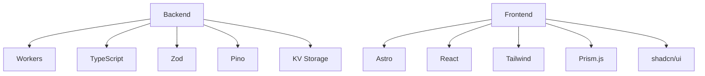
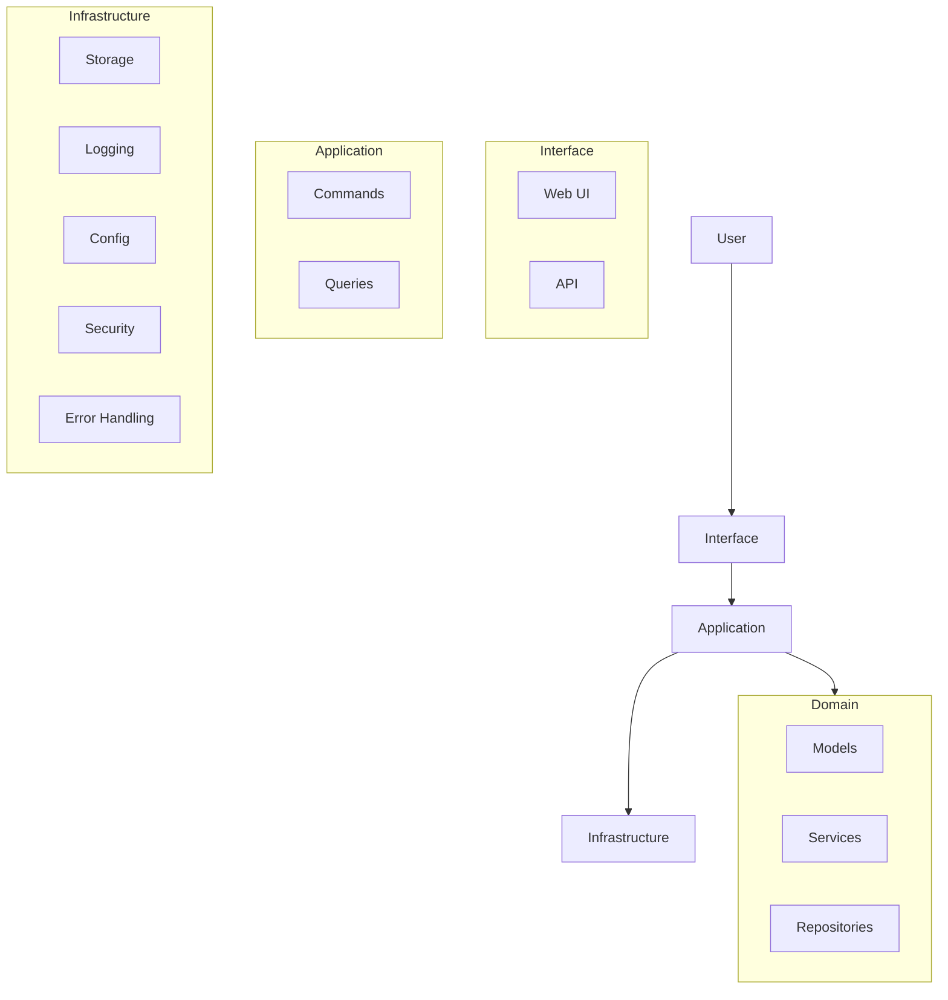
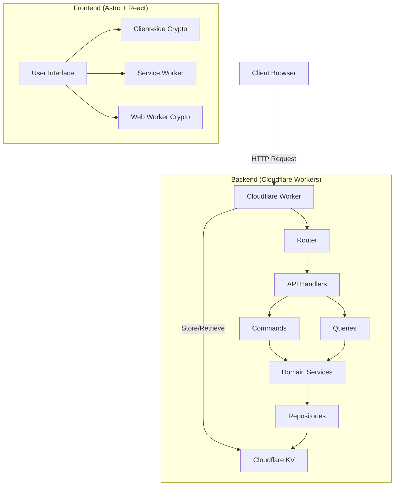
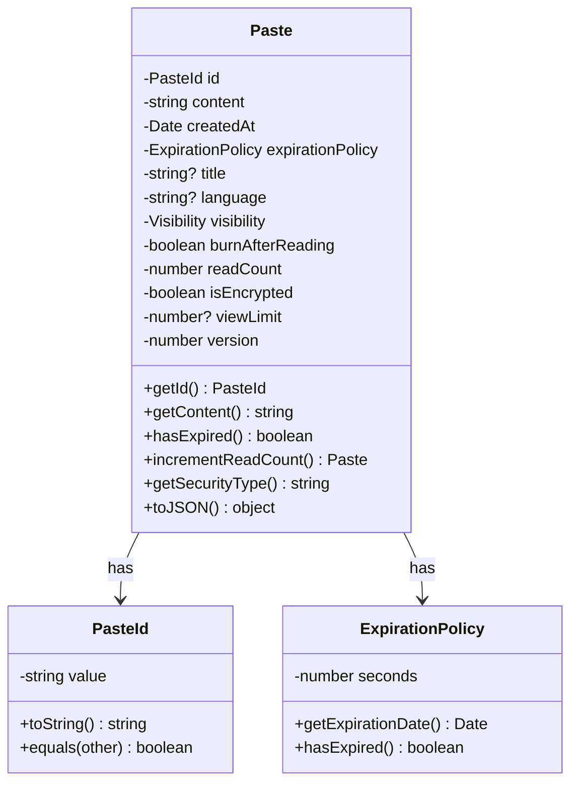
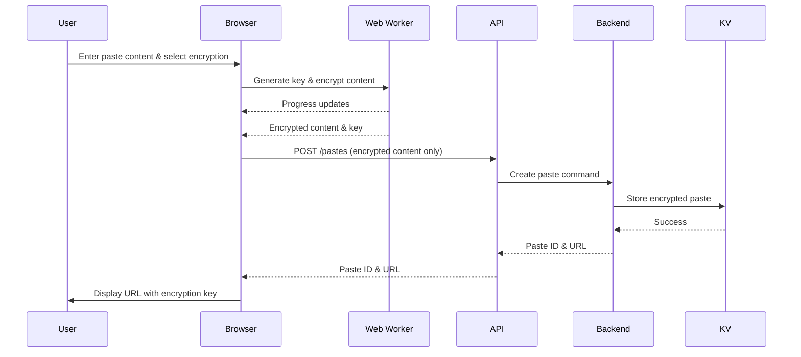
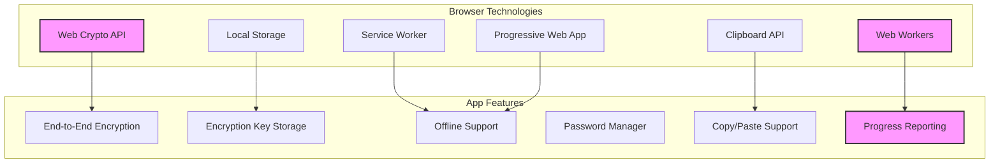
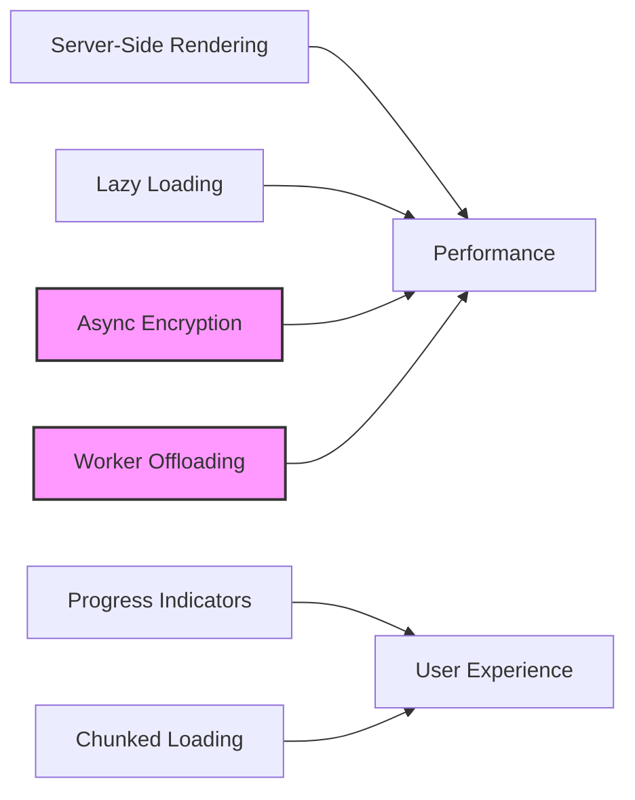
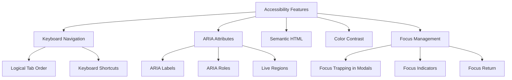

# Pasteriser

A modern, secure code sharing service built on Cloudflare Workers with Domain-Driven Design principles. Create and share code snippets with syntax highlighting, password protection, and burn-after-reading functionality.

## Features

- **Advanced Code Sharing**
  - Create and view text/code pastes with rich formatting
  - Syntax highlighting for 40+ programming languages with Prism.js
  - Custom expiration times (1 hour to 1 year)
  - Public and private visibility options
  - View limits with automatic deletion
  
- **Security & Privacy**
  - End-to-end encryption for sensitive content
  - Password protection with strong key derivation
  - "Burn after reading" self-destructing pastes
  - Client-side encryption with secure key sharing
  - Rate limiting and content validation
  - Private pastes hidden from listings
  
- **Enhanced User Experience**
  - Modern UI with dark mode support
  - Toast notifications for user feedback
  - Improved modal confirmations
  - Line numbers for code readability
  - One-click copy to clipboard
  - Raw view for easy embedding
  - Mobile-responsive design
  - Progressive loading for large pastes

- **Progressive Web App**
  - Installable on desktop and mobile devices
  - Offline support with custom offline page
  - Optimized for mobile experience
  - Service worker for improved performance

- **Robust Error Handling**
  - Comprehensive error categorization
  - User-friendly error messages
  - Error recovery mechanisms
  - Detailed error logging with privacy safeguards
  - React error boundaries for component-level errors

## Technology Stack



- **Backend**
  - Cloudflare Workers: Serverless edge computing
  - TypeScript: Strongly typed JavaScript
  - Zod: Runtime schema validation
  - Pino: Structured logging
  - Cloudflare KV: Key-value storage

- **Frontend**
  - Astro: Static site generation
  - React: Interactive UI components
  - Tailwind CSS: Utility-first styling
  - Prism.js: Advanced syntax highlighting
  - shadcn/ui: Accessible component library
  - TweetNaCl.js: Cryptographic operations

## Architecture

This project follows Domain-Driven Design principles with a clean architecture approach:



### Architectural Layers

The application is structured in four primary layers following Domain-Driven Design principles:

1. **Domain Layer**: Core business logic and entities
   - Paste model and value objects
   - Repository interfaces
   - Domain services for core business logic

2. **Application Layer**: Use cases and orchestration
   - Command handlers (create/delete pastes)
   - Query handlers (retrieve pastes)
   - Factories for domain object creation

3. **Infrastructure Layer**: Technical capabilities
   - KV storage implementation
   - Logging services
   - Security services
   - Error handling
   - Configuration management

4. **Interface Layer**: User interfaces and APIs
   - API endpoints
   - Astro pages
   - React components
   - UI utilities

### System Overview



### Core Domain Model

The application is centered around the **Paste** concept - a text/code snippet with metadata and security features.



## End-to-End Encryption

Pasteriser implements true end-to-end encryption (E2EE), meaning that all encryption and decryption happens in the user's browser, not on the server. This provides strong privacy guarantees:

1. The server never sees the unencrypted content
2. The server never receives the encryption password or key
3. Only users with the correct password or full URL (containing the key) can decrypt the content



### Security Methods

When creating a paste, users can choose between two security methods:

1. **Password Protection (E2EE)**:
   - A user-supplied password is used to derive an encryption key via PBKDF2
   - A unique random salt is generated for each paste
   - The content is encrypted with the derived key
   - The encrypted content includes the salt so it can be decrypted later
   - The server never receives the password

2. **Key Protection (E2EE)**:
   - A random 32-byte encryption key is generated
   - The content is encrypted with this key
   - The key is appended to the URL fragment (after the # symbol)
   - URL fragments are never sent to the server
   - Only people with the complete URL can decrypt the content

### Encryption Implementation

- **Symmetric Encryption**: XSalsa20-Poly1305 via TweetNaCl.js (`nacl.secretbox`)
- **Key Derivation**: PBKDF2 via Web Crypto API with 300,000 iterations for password-based encryption
- **Random Generation**: Cryptographically secure random number generation for keys, nonces, and salts

### Web Worker Optimization

For improved performance, cryptographic operations use Web Workers:

- Prevents UI freezing during heavy cryptographic operations
- Provides responsive feedback via progress reporting
- Optimizes CPU utilization on multi-core systems
- Selective offloading: Only pastes larger than 10KB are processed in the worker
- Resource management: Workers are terminated after 60 seconds of inactivity



## Performance Optimizations

Pasteriser implements several performance optimizations:



1. **Astro Partial Hydration**: Only hydrate interactive components
2. **Web Worker Offloading**: Move CPU-intensive crypto to background threads
3. **Chunked Rendering**: Progressive loading for large pastes
4. **Selective Encryption**: Only use workers for data >10KB
5. **Service Worker Caching**: Offline access and faster repeat visits
6. **React Hydration Optimization**: Delayed React initialization

## API Reference

### API Endpoints

The API is RESTful and follows standard HTTP conventions.

#### Create a Paste

**Endpoint:** `POST /pastes`

**Request Body:**
```json
{
  "content": "string", 
  "title": "string",
  "language": "string",
  "expiration": 86400,
  "visibility": "public",
  "password": "string",
  "burnAfterReading": false
}
```

**Response:**
```json
{
  "id": "string",
  "url": "string",
  "expiresAt": "string"
}
```

#### Get a Paste

**Endpoint:** `GET /pastes/:id`

**Response:**
```json
{
  "id": "string",
  "content": "string",
  "title": "string",
  "language": "string",
  "createdAt": "string",
  "expiresAt": "string",
  "visibility": "public",
  "isPasswordProtected": false,
  "burnAfterReading": false
}
```

#### Access a Password-Protected Paste

**Endpoint:** `POST /pastes/:id`

**Request Body:**
```json
{
  "password": "string"
}
```

#### Get Raw Paste Content

**Endpoint:** `GET /pastes/raw/:id`

### Rate Limiting

Rate limiting is applied to protect the service:

- General rate limit: 60 requests per minute
- Paste creation: 10 pastes per minute

## Getting Started

### Prerequisites

- Node.js (v16+)
- npm or yarn
- Wrangler CLI (`npm install -g wrangler`)
- Cloudflare account

### Installation

```bash
# Clone the repository
git clone https://github.com/username/pastebin.git
cd pastebin

# Install main project dependencies
npm install

# Install Astro UI dependencies
cd astro
npm install
cd ..
```

### Configure Cloudflare KV Namespace

Create a KV namespace for storing pastes:

```bash
wrangler kv:namespace create PASTES
```

Update the `wrangler.jsonc` file with your KV namespace ID:

```jsonc
{
  // ...
  "kv_namespaces": [
    {
      "binding": "PASTES",
      "id": "your-namespace-id",
      "preview_id": "your-preview-namespace-id"
    }
  ],
  // ...
}
```

### Development

Start the development server with both the Worker API and Astro UI:

```bash
npm run dev:all
```

This will:
- Start the Astro UI at http://localhost:3000
- Start the Cloudflare Worker at http://localhost:8787

### Building for Production

Build the project for production:

```bash
npm run build
```

### Deployment

Deploy to Cloudflare:

```bash
npm run deploy
```

## Project Commands

- `npm run dev:all` - Start both UI and Worker development servers
- `npm run dev:ui` - Start only the Astro UI development server
- `npm run dev` - Start only the Cloudflare Worker
- `npm run build` - Build both UI and Worker for production
- `npm run deploy` - Deploy to Cloudflare Workers
- `npm run test` - Run tests
- `npm run test:watch` - Run tests in watch mode
- `npm run lint` - Run ESLint
- `npm run check` - Run TypeScript typechecking

## Testing End-to-End Encryption

This section outlines how to test the encryption features in the application.

### Test Scenarios

#### Creating Pastes with Different Security Methods

1. **No Encryption (Plaintext)**
   - Create a paste with "None (Plaintext)" security option
   - Verify the paste is viewable without encryption indicators
   - Content is sent to server in plaintext

2. **Key-Based Encryption**
   - Create a paste with "Key Protection (E2EE)" security option
   - Verify URL contains a fragment identifier (#key=...)
   - Only encrypted content is sent to server

3. **Password-Based Encryption**
   - Create a paste with "Password Protection (E2EE)" option
   - Enter password and observe strength meter
   - Verify URL doesn't contain the encryption key
   - Password is never sent to the server

#### Viewing and Decrypting Pastes

1. **Viewing Key-Encrypted Paste**
   - With complete URL: Content should automatically decrypt
   - With incomplete URL: Encryption warning should be displayed

2. **Viewing Password-Encrypted Paste**
   - Password form should be displayed
   - Correct password should decrypt content
   - Incorrect password should show error message

#### Browser Integration Features

1. **Password Manager Integration**
   - Password fields should work with browser password managers
   - Password should be savable and auto-fillable

2. **Copy to Clipboard Functions**
   - URL with encryption key should copy correctly
   - Toast notifications should confirm successful copying

3. **Key Storage**
   - "Save Key" button should store key in localStorage
   - Revisiting without key in URL should offer to use saved key

### Web Worker Performance Testing

1. **Worker-Based Encryption/Decryption**
   - Create a paste with large content (500KB+)
   - Verify separate Web Worker thread in performance profile
   - UI should remain responsive during encryption

2. **Progress Reporting**
   - Large content should show progress bars
   - Progress percentage should update incrementally
   - UI should remain responsive during processing

3. **Worker Fallback Testing**
   - Disable Web Workers in browser
   - Verify encryption still works on main thread
   - No errors should be shown to the user

4. **Long Content and Special Characters**
   - Very large pastes (1MB+) should work correctly
   - Unicode and special characters should be preserved
   - Encrypted content should decrypt correctly

### Security Testing Considerations

- Server should never receive plaintext for encrypted pastes
- Server should never receive encryption keys or passwords
- Decryption should always happen entirely client-side
- Encryption keys should be properly secured in URL fragments

## Accessibility

Pasteriser implements several accessibility features to ensure usability for all users:



### Core Accessibility Features

1. **Semantic HTML Structure**:
   - Using appropriate HTML elements
   - Properly structured headings
   - Meaningful form labels and field associations
   - Landmark regions for navigation

2. **ARIA Implementation**:
   - ARIA roles for complex components
   - ARIA live regions for dynamic content changes
   - ARIA labels and descriptions for clarity
   - Status indicators for operations in progress

3. **Keyboard Navigation**:
   - All interactive elements are keyboard accessible
   - Custom keyboard shortcuts for common actions
   - Focus management for modal dialogs
   - Skip links for keyboard users

4. **Visual Design Considerations**:
   - High contrast color options
   - Text resizing without breaking layouts
   - Visible focus indicators that meet WCAG standards
   - Non-color-dependent status indicators

## Future Enhancements

1. **Enhanced Security Features**
   - Two-factor authentication for admin operations
   - Content scanning for harmful material
   - Advanced rate limiting strategies
   - Improved encryption key management

2. **User Experience Improvements**
   - User accounts (optional)
   - Paste collections and organization
   - Enhanced code editor with more features
   - Collaborative editing capabilities
   - Improved mobile experience

3. **Performance Optimizations**
   - Implement code splitting for faster loading
   - Add progressive enhancement for core functionality
   - Optimize large file handling
   - Enhance caching strategies

4. **Integrations**
   - GitHub Gist import/export
   - VS Code extension
   - Webhook notifications
   - Integration with CI/CD systems

## Browser Compatibility

Feature support varies by browser with appropriate fallbacks:

| Feature | Chrome/Edge (60+) | Firefox (55+) | Safari (11+) | Opera (47+) | Fallback Behavior |
|---------|------------------|--------------|-------------|------------|-------------------|
| Web Workers | ✅ | ✅ | ✅ | ✅ | Main thread processing |
| Web Crypto API | ✅ | ✅ | ✅ | ✅ | Alert for unsupported browser |
| Service Workers | ✅ | ✅ | ✅* | ✅ | Standard page loading |
| Password Manager | ✅ | ✅ | ✅ | ✅ | Manual password entry |
| LocalStorage | ✅ | ✅ | ✅** | ✅ | No key persistence |
| Clipboard API | ✅ | ✅ | ✅ | ✅ | Manual copy instructions |

*Safari has some limitations with Service Workers in private browsing mode.
**Safari in private browsing mode limits localStorage.

## License

[MIT License](./LICENSE) © 2025 Erfi Anugrah