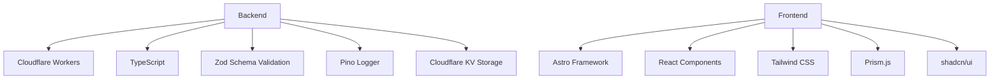
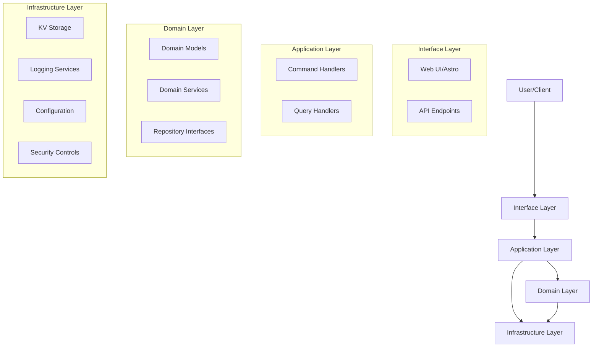

# Pasteriser

A modern, secure code sharing service built on Cloudflare Workers with Domain-Driven Design principles. Create and share code snippets with syntax highlighting, password protection, and burn-after-reading functionality.

## Features

- **Advanced Code Sharing**
  - Create and view text/code pastes with rich formatting
  - Syntax highlighting for 40+ programming languages with Prism.js
  - Custom expiration times (1 hour to 1 year)
  - Public and private visibility options
  
- **Security & Privacy**
  - Password protection for sensitive pastes
  - "Burn after reading" self-destructing pastes
  - Rate limiting and content validation
  - Private pastes hidden from listings
  
- **Enhanced User Experience**
  - Modern UI with dark mode support
  - Toast notifications for user feedback
  - Improved modal confirmations
  - Line numbers for code readability
  - One-click copy to clipboard
  - Raw view for easy embedding
  - Mobile-responsive design

- **Progressive Web App**
  - Installable on desktop and mobile devices
  - Offline support with custom offline page
  - Optimized for mobile experience
  - Service worker for improved performance

- **Infrastructure**
  - Comprehensive logging system
  - Robust error handling
  - Analytics tracking
  - Performance-optimized caching

## Technology Stack



- **Backend**
  - Cloudflare Workers: Serverless edge computing
  - TypeScript: Strongly typed JavaScript
  - Zod: Runtime schema validation
  - Pino: Structured logging
  - Cloudflare KV: Key-value storage

- **Frontend**
  - Astro: Static site generation
  - React: Interactive UI components
  - Tailwind CSS: Utility-first styling
  - Prism.js: Advanced syntax highlighting
  - shadcn/ui: Accessible component library

## Architecture

This project follows Domain-Driven Design principles with a clean architecture approach:



- **Domain Layer**: Core business logic and entities (Paste model, repositories)
- **Application Layer**: Use cases and application orchestration (commands/queries)
- **Infrastructure Layer**: Technical capabilities (storage, logging, caching)
- **Interface Layer**: User interfaces (API endpoints, Astro pages, React components)

## Getting Started

### Prerequisites

- Node.js (v18+)
- npm or yarn
- Wrangler CLI (`npm install -g wrangler`)
- Cloudflare account

### Installation

```bash
# Clone the repository
git clone https://github.com/username/pastebin.git
cd pastebin

# Install dependencies
npm install
```

### Development

The project includes several npm scripts to help with development:

```bash
# Start development server for backend
npm run dev

# Start UI development server
npm run dev:ui

# Start both backend and UI servers concurrently
npm run dev:all

# Run TypeScript type checking
npm run check

# Run tests
npm test
```

### Configuration

The application is configured through `wrangler.jsonc`. You need to:

1. Create a KV namespace for paste storage
2. Update the `wrangler.jsonc` with your KV namespace ID
3. Configure any custom domains if needed

### Deployment

Deploy to Cloudflare Workers:

```bash
# Deploy to staging
npm run deploy:staging

# Deploy to production
npm run deploy:prod
```

## Documentation

- [API Documentation](./docs/API.md) - API endpoints and usage
- [Development Guide](./docs/DEVELOPMENT.md) - Getting started with development
- [Architecture](./docs/ARCHITECTURE.md) - Detailed architecture overview
- [Next Steps](./docs/NEXT_STEPS.md) - Future development plans
- [Features](./docs/FEATURES.md) - Detailed feature documentation

## Contributing

Contributions are welcome! Please feel free to submit a Pull Request.

## Documentation

For comprehensive documentation, please see the following resources:

- [Comprehensive Documentation](./docs/DOCUMENTATION.md) - Complete guide to the application
- [API Reference](./docs/API.md) - API endpoints and usage details
- [Development Guide](./docs/DEVELOPMENT.md) - Getting started with development
- [Architecture](./docs/ARCHITECTURE.md) - Detailed architecture overview
- [Frontend Architecture](./docs/FRONTEND_ARCHITECTURE.md) - Component design and UI patterns
- [Features](./docs/FEATURES.md) - Detailed feature specifications
- [PWA Implementation](./docs/PWA_SETUP.md) - Progressive Web App setup instructions

## License

[MIT License](./LICENSE) © 2025 Erfi Anugrah