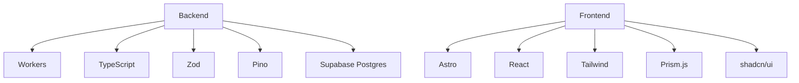
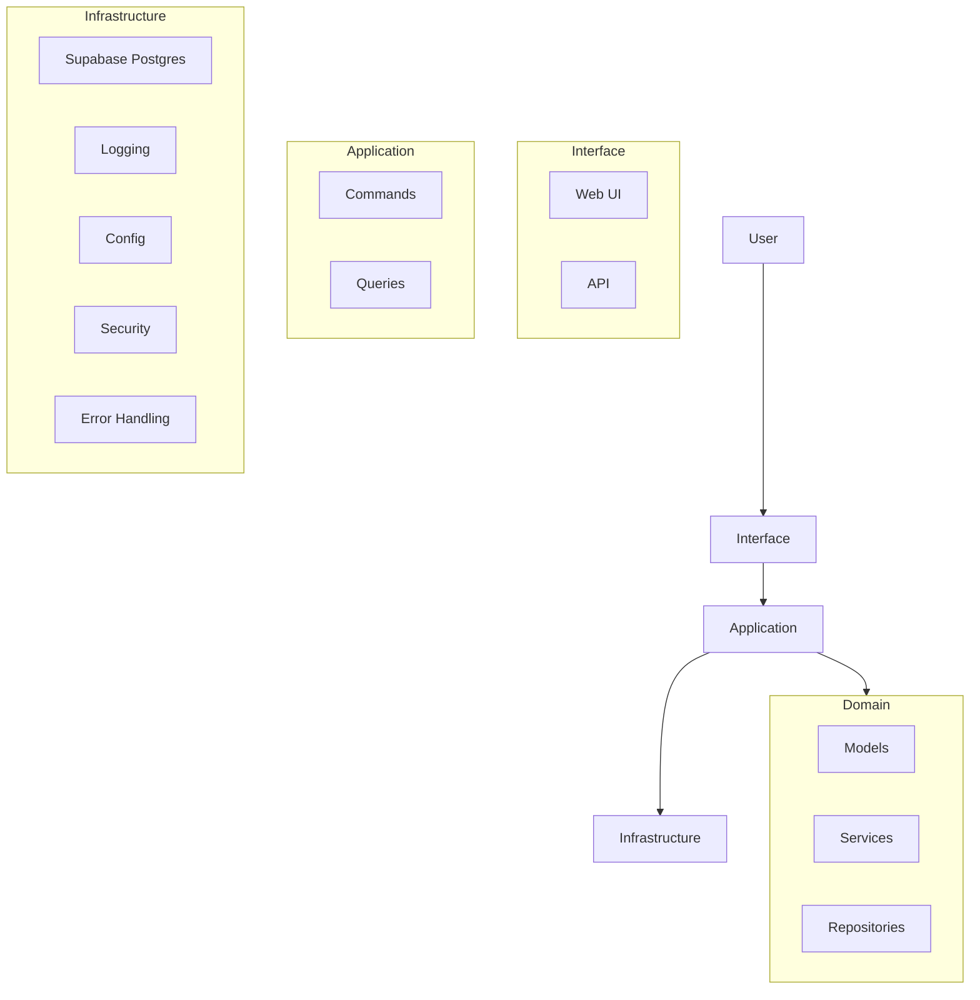
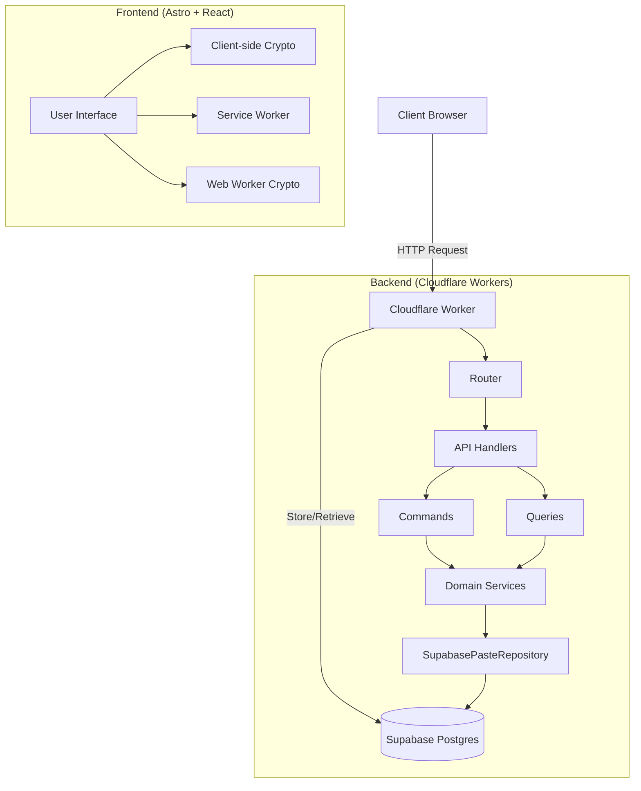
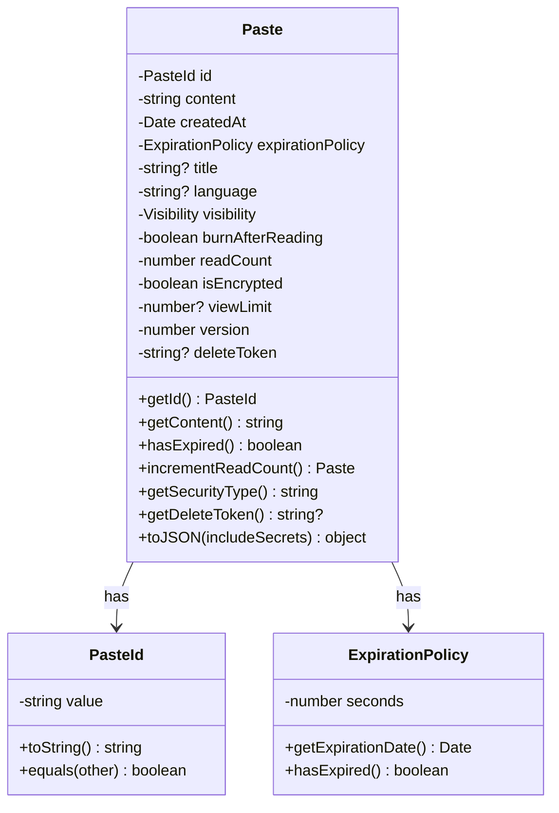
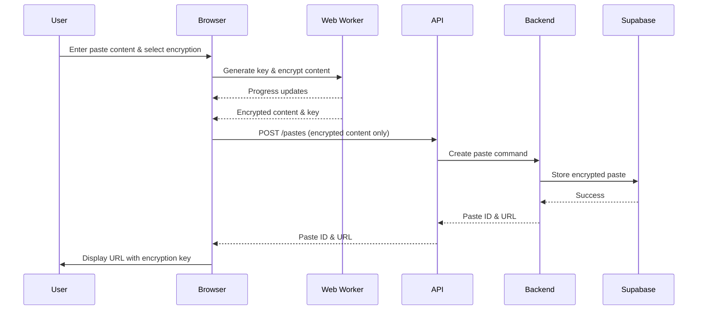
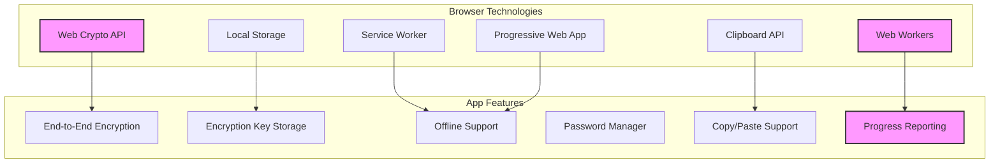
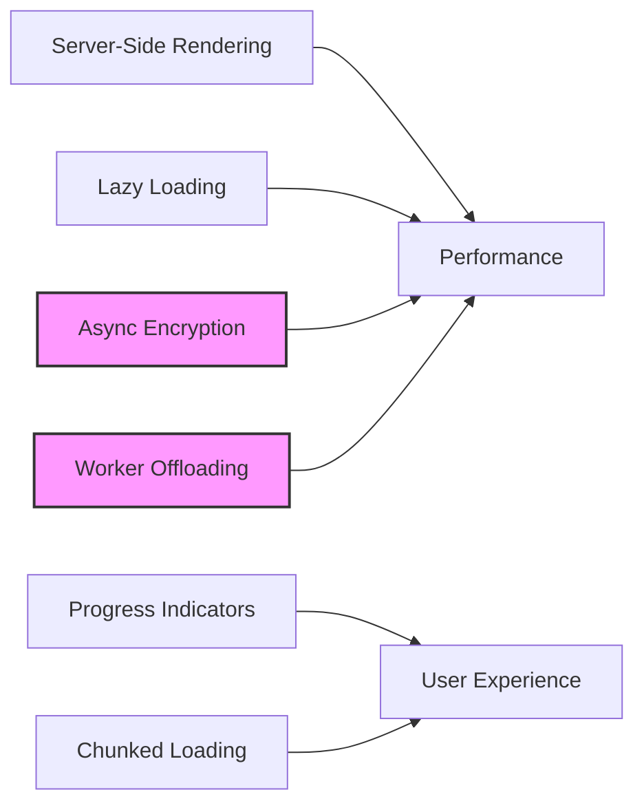
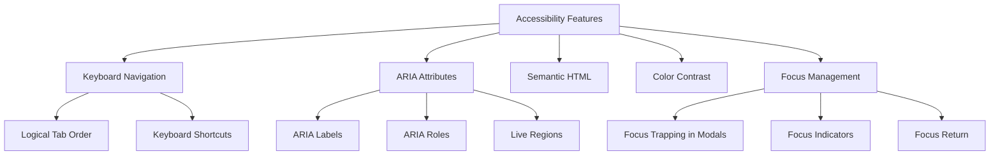

# Pasteriser

A code-sharing service on Cloudflare Workers + Supabase Postgres. Syntax-highlighted pastes, client-side end-to-end encryption, burn-after-reading, full-text search, and optional Supabase Auth for user-owned pastes. DDD architecture (domain → application → infrastructure → interfaces).

Live at [paste.erfi.io](https://paste.erfi.io).

## Features

- **Paste core**
  - Plain text or syntax-highlighted code (40+ languages via Prism.js)
  - Expiration: 1 hour to 1 year (enforced by pg_cron)
  - Public or private visibility
  - View limits with automatic deletion
  - Burn-after-reading (atomic via Postgres `view_paste()` RPC with `FOR UPDATE` row lock)
  - Vanity slugs (`/p/<slug>`)
  - Multi-file pastes
  
- **Encryption & privacy**
  - End-to-end encryption (client-side, AES-GCM via Web Crypto API)
  - Key in URL fragment — server never sees plaintext or keys
  - Password mode (PBKDF2 key derivation) and key mode (256-bit random)
  - Decryption happens in a Web Worker for non-blocking UX
  - Encrypted localStorage for any sensitive client state

- **Auth & ownership** (optional)
  - Supabase Auth (email + password, server-side email confirmation, password recovery, magic-link, GitHub OAuth)
  - Pastes optionally linked to a user via `user_id`
  - `/my` page lists user's pastes (browser → Supabase direct, filtered by RLS)
  - Anonymous use unchanged — `user_id = NULL`, `deleteToken` flow

- **Discovery**
  - Recent public pastes feed (polling-based; the Realtime broadcast pipeline was dropped — see `SUPABASE-MIGRATION.md`)
  - Full-text search (Postgres tsvector + GIN, websearch syntax)

- **Hardening**
  - Per-IP rate limiting via Cloudflare Workers Rate Limiting bindings on auth, paste-create, session, and search endpoints
  - CSP, X-Frame-Options, HSTS, X-Content-Type-Options
  - CORS allowlist
  - XSS prevention (no `innerHTML` on user data, programmatic DOM creation)
  - Open-redirect defence on `/auth/confirm?next=…` via origin-equality post-URL-parse
  - Delete-token rejected in query string (body-only) to prevent leakage via logpush
  
- **Enhanced User Experience**
  - Modern UI with dark mode support
  - Toast notifications for user feedback
  - Improved modal confirmations
  - Line numbers for code readability
  - One-click copy to clipboard
  - Raw view for easy embedding
  - Mobile-responsive design
  - Progressive loading for large pastes

- **Progressive Web App**
  - Installable on desktop and mobile devices
  - Offline support with custom offline page
  - Optimized for mobile experience
  - Service worker for improved performance

- **Robust Error Handling**
  - Comprehensive error categorization
  - User-friendly error messages
  - Error recovery mechanisms
  - Detailed error logging with privacy safeguards
  - React error boundaries for component-level errors

## Technology Stack


```mermaid
graph TD
    BE[Backend] --> CF[Workers]
    BE --> TS[TypeScript]
    BE --> Zod[Zod]
    BE --> Pino[Pino]
    BE --> SB[Supabase Postgres]
    
    FE[Frontend] --> Astro[Astro]
    FE --> React[React]
    FE --> TW[Tailwind]
    FE --> Prism[Prism.js]
    FE --> UI[shadcn/ui]
```

- **Backend**
  - Cloudflare Workers: Serverless edge computing
  - TypeScript: Strongly typed JavaScript
  - Zod: Runtime schema validation
  - Pino: Structured logging
  - Supabase Postgres: Primary data store (migrated from Cloudflare KV)

- **Frontend**
  - Astro: Static site generation
  - React: Interactive UI components
  - Tailwind CSS: Utility-first styling
  - Prism.js: Advanced syntax highlighting
  - shadcn/ui: Accessible component library
  - TweetNaCl.js: Cryptographic operations

## Architecture

This project follows Domain-Driven Design principles with a clean architecture approach:


```mermaid
graph TD
    User[User] --> UI[Interface]
    UI --> App[Application]
    App --> Domain[Domain]
    App --> Infra[Infrastructure]
    
    subgraph "Interface"
      Web[Web UI]
      API[API]
    end
    
    subgraph "Application"
      Cmd[Commands]
      Qry[Queries]
    end
    
    subgraph "Domain"
      Model[Models]
      Svc[Services]
      Repo[Repositories]
    end
    
    subgraph "Infrastructure"
      DB[Supabase Postgres]
      Log[Logging]
      Cfg[Config]
      Sec[Security]
      Err[Error Handling]
    end
```

### Architectural Layers

The application is structured in four primary layers following Domain-Driven Design principles:

1. **Domain Layer**: Core business logic and entities
   - Paste model and value objects
   - Repository interfaces
   - Domain services for core business logic

2. **Application Layer**: Use cases and orchestration
   - Command handlers (create/delete pastes)
   - Query handlers (retrieve pastes)
   - Factories for domain object creation

3. **Infrastructure Layer**: Technical capabilities
   - Supabase Postgres storage backend (KV removed in Phase 5)
   - Logging services
   - Security services
   - Error handling
   - Configuration management

4. **Interface Layer**: User interfaces and APIs
   - API endpoints
   - Astro pages
   - React components
   - UI utilities

### System Overview


```mermaid
graph TD
    Client[Client Browser] --> |HTTP Request| Worker[Cloudflare Worker]
    Worker --> |Store/Retrieve| DB[(Supabase Postgres)]
    
    subgraph "Frontend (Astro + React)"
        UI[User Interface] --> CryptoClient[Client-side Crypto]
        UI --> ServiceWorker[Service Worker]
        UI --> CryptoWorker[Web Worker Crypto]
    end
    
    subgraph "Backend (Cloudflare Workers)"
        Worker --> Router[Router]
        Router --> Handlers[API Handlers]
        Handlers --> Commands[Commands]
        Handlers --> Queries[Queries]
        Commands --> Services[Domain Services]
        Queries --> Services
        Services --> Repositories[SupabasePasteRepository]
        Repositories --> DB
    end
```

### Core Domain Model

The application is centered around the **Paste** concept - a text/code snippet with metadata and security features.


```mermaid
classDiagram
    class Paste {
        -PasteId id
        -string content
        -Date createdAt
        -ExpirationPolicy expirationPolicy
        -string? title
        -string? language
        -Visibility visibility
        -boolean burnAfterReading
        -number readCount
        -boolean isEncrypted
        -number? viewLimit
        -number version
        -string? deleteToken
        +getId() PasteId
        +getContent() string
        +hasExpired() boolean
        +incrementReadCount() Paste
        +getSecurityType() string
        +getDeleteToken() string?
        +toJSON(includeSecrets) object
    }
    
    class PasteId {
        -string value
        +toString() string
        +equals(other) boolean
    }
    
    class ExpirationPolicy {
        -number seconds
        +getExpirationDate() Date
        +hasExpired() boolean
    }
    
    Paste --> PasteId : has
    Paste --> ExpirationPolicy : has
```

## End-to-End Encryption

Pasteriser implements true end-to-end encryption (E2EE), meaning that all encryption and decryption happens in the user's browser, not on the server. This provides strong privacy guarantees:

1. The server never sees the unencrypted content
2. The server never receives the encryption password or key
3. Only users with the correct password or full URL (containing the key) can decrypt the content


```mermaid
sequenceDiagram
    participant User
    participant Browser
    participant Worker as Web Worker
    participant API
    participant Backend
    participant DB as Supabase

    User->>Browser: Enter paste content & select encryption
    Browser->>Worker: Generate key & encrypt content
    Worker-->>Browser: Progress updates
    Worker-->>Browser: Encrypted content & key
    Browser->>API: POST /pastes (encrypted content only)
    API->>Backend: Create paste command
    Backend->>DB: Store encrypted paste
    DB-->>Backend: Success
    Backend-->>API: Paste ID & URL
    API-->>Browser: Paste ID & URL
    Browser->>User: Display URL with encryption key
```

### Security Methods

When creating a paste, users can choose between two security methods:

1. **Password Protection (E2EE)**:
   - A user-supplied password is used to derive an encryption key via PBKDF2
   - A unique random salt is generated for each paste
   - The content is encrypted with the derived key
   - The encrypted content includes the salt so it can be decrypted later
   - The server never receives the password

2. **Key Protection (E2EE)**:
   - A random 32-byte encryption key is generated
   - The content is encrypted with this key
   - The key is appended to the URL fragment (after the # symbol)
   - URL fragments are never sent to the server
   - Only people with the complete URL can decrypt the content

### Encryption Implementation

- **Symmetric Encryption**: XSalsa20-Poly1305 via TweetNaCl.js (`nacl.secretbox`)
- **Key Derivation**: PBKDF2 via Web Crypto API with 300,000 iterations for password-based encryption
- **Random Generation**: Cryptographically secure random number generation for keys, nonces, and salts

### Web Worker Optimization

For improved performance, cryptographic operations use Web Workers:

- Prevents UI freezing during heavy cryptographic operations
- Provides responsive feedback via progress reporting
- Optimizes CPU utilization on multi-core systems
- Selective offloading: Only pastes larger than 10KB are processed in the worker
- Resource management: Workers are terminated after 60 seconds of inactivity


```mermaid
flowchart TB
    subgraph "Browser Technologies"
        WebCrypto[Web Crypto API]
        WebStorage[Local Storage]
        Workers[Web Workers]
        PWA[Progressive Web App]
        Clipboard[Clipboard API]
        ServiceWorker[Service Worker]
    end
    
    subgraph "App Features"
        E2E[End-to-End Encryption]
        KeyStorage[Encryption Key Storage]
        OfflineSupport[Offline Support]
        PasswordManager[Password Manager]
        CopyPaste[Copy/Paste Support]
        ProgressReporting[Progress Reporting]
    end
    
    WebCrypto --> E2E
    WebStorage --> KeyStorage
    ServiceWorker --> OfflineSupport
    Clipboard --> CopyPaste
    Workers --> ProgressReporting
    PWA --> OfflineSupport
    
    class Workers,WebCrypto,ProgressReporting emphasis
    classDef emphasis fill:#f9f,stroke:#333,stroke-width:2px
```

## Performance Optimizations

Pasteriser implements several performance optimizations:


```mermaid
flowchart LR
    SSR[Server-Side Rendering]
    LazyLoad[Lazy Loading]
    AsyncCrypto[Async Encryption]
    WorkerOffload[Worker Offloading]
    ProgressUI[Progress Indicators]
    ChunkedLoad[Chunked Loading]

    SSR --> Performance
    LazyLoad --> Performance
    AsyncCrypto --> Performance
    WorkerOffload --> Performance
    ProgressUI --> UX[User Experience]
    ChunkedLoad --> UX
    
    class WorkerOffload,AsyncCrypto emphasis
    classDef emphasis fill:#f9f,stroke:#333,stroke-width:2px
```

1. **Astro Partial Hydration**: Only hydrate interactive components
2. **Web Worker Offloading**: Move CPU-intensive crypto to background threads
3. **Chunked Rendering**: Progressive loading for large pastes
4. **Selective Encryption**: Only use workers for data >10KB
5. **Service Worker Caching**: Offline access and faster repeat visits
6. **React Hydration Optimization**: Delayed React initialization

## API Reference

### API Endpoints

The API is RESTful and follows standard HTTP conventions.

#### Create a Paste

**Endpoint:** `POST /pastes`

**Request Body:**
```json
{
  "content": "string",
  "title": "string",
  "language": "string",
  "expiresIn": "1d",
  "visibility": "public",
  "burnAfterReading": false,
  "isEncrypted": false,
  "viewLimit": 10,
  "version": 2,
  "slug": "my-paste"
}
```

| Field | Type | Required | Description |
|-------|------|----------|-------------|
| `content` | string | Yes | Paste content (max 25 MiB) |
| `title` | string | No | Title (max 100 chars) |
| `language` | string | No | Syntax highlighting language |
| `expiresIn` | string\|number | No | Expiration: `"1h"`, `"1d"`, `"7d"`, or seconds (default: `"1d"`) |
| `visibility` | string | No | `"public"` or `"private"` (default: `"public"`) |
| `burnAfterReading` | boolean | No | Self-destruct after first view (atomic via `view_paste()` RPC) |
| `isEncrypted` | boolean | No | Whether content is already client-side E2E encrypted |
| `viewLimit` | number | No | Max views before auto-deletion (1-100) |
| `version` | number | No | Encryption version (0=plaintext, 2=client-side E2E) |
| `slug` | string | No | Optional vanity slug. Becomes the URL `/p/<slug>`. |

Server-side password protection was removed in 2026; security is entirely client-side E2EE.

**Response:**
```json
{
  "id": "string",
  "url": "string",
  "expiresAt": "string",
  "deleteToken": "string"
}
```

> **Important:** The `deleteToken` is returned only at creation time. Store it securely — it is the only way to authorize deletion of the paste.

#### Get a Paste

**Endpoint:** `GET /pastes/:id`

Set `Accept: application/json` to receive JSON. HTML requests are served the Astro viewer page.

**Response:**
```json
{
  "id": "string",
  "content": "string",
  "title": "string",
  "language": "string",
  "createdAt": "string",
  "expiresAt": "string",
  "visibility": "public",
  "burnAfterReading": false,
  "readCount": 1,
  "isEncrypted": false,
  "hasViewLimit": false,
  "viewLimit": null,
  "remainingViews": null,
  "version": 0,
  "securityType": "Public"
}
```

#### Get Raw Paste Content

**Endpoint:** `GET /pastes/raw/:id`

Returns the raw paste content as `text/plain`.

#### Recent Public Pastes

**Endpoint:** `GET /api/recent?limit=20`

Returns the most recently created public, non-expired pastes. Limit clamped to `[1, 100]`, default 10.

```json
{
  "pastes": [
    { "id": "...", "title": "...", "language": "...", "createdAt": "...", "expiresAt": "...", "readCount": 3 }
  ]
}
```

For polling, re-fetch this endpoint on a schedule (default UI behaviour). The Realtime broadcast pipeline that previously powered a push feed was dropped in `20260512102410_drop_realtime_broadcast.sql` — the frontend never subscribed and the CSP `connect-src 'self'` directive blocked WebSocket to `*.supabase.co` anyway.

#### Full-Text Search

**Endpoint:** `GET /api/search?q=<query>&limit=20`

Searches public, non-expired pastes by title + language using Postgres FTS (`tsvector` GIN index, `websearch_to_tsquery` parsing). Limit clamped to `[1, 50]`, query truncated to 200 chars.

Empty/whitespace `q` returns `{ "pastes": [], "query": "" }` without hitting the database.

```json
{
  "pastes": [
    { "id": "...", "title": "...", "language": "...", "createdAt": "...", "expiresAt": "...", "readCount": 5 }
  ],
  "query": "the trimmed search query"
}
```

Supports `websearch_to_tsquery` syntax: `"phrase quoting"`, boolean `OR`, `-excluded`.

#### Authentication & My Pastes

**Pages:** `/login`, `/signup`, `/my`.

Pasteriser supports optional Supabase Auth. Five sign-in/up paths, all proxied through the Worker (BFF):

| Path | Endpoint | Notes |
|---|---|---|
| Email + password signup | `POST /api/auth/signup` | Returns 409 `email_taken` for duplicates (decodes Supabase's anti-enumeration response) |
| Email + password login | `POST /api/auth/login` | 403 `email_not_confirmed` distinguished from 401 `invalid_credentials` |
| Password recovery | `POST /api/auth/forgot-password` + `POST /api/auth/update-password` | Email link lands at `/auth/confirm?type=recovery&next=/auth/reset-password` |
| Magic link (passwordless) | `POST /api/auth/magic-link` | `signInWithOtp({ shouldCreateUser: false })` — re-entry only, not new signups |
| GitHub OAuth | `GET /api/auth/oauth/github` → `GET /auth/callback` | Manual PKCE handling in the Worker; auto-links to existing email user when verified email matches |
| Resend confirmation | `POST /api/auth/resend-confirmation` | Used by both the signup success panel and the "email_not_confirmed" login error |

When signed in:

- New pastes are linked to the authenticated user via `user_id`.
- All Supabase Auth calls are proxied through the Worker (`/api/auth/signup`, `/api/auth/login`, `/api/auth/logout`, `/api/auth/session`, `/api/auth/resend-confirmation`, `/api/auth/forgot-password`, `/api/auth/update-password`, `/api/auth/magic-link`, `/api/auth/oauth/:provider`). The session is stored in HttpOnly `sb-access-token` + `sb-refresh-token` cookies (Secure, SameSite=Strict). Browser never receives the JWT directly — XSS-safe.
- Email confirmation uses the Path C server-side pattern: the email link points to `/auth/confirm?token_hash=...&type=signup&next=/my` on Pasteriser's domain (not Supabase's). The Worker calls `supabase.auth.verifyOtp({ token_hash, type })`, sets cookies, then 302s into the app. `next` is whitelisted to same-origin paths only.
- The Worker derives `user_id` from the verified JWT (cookie wins over `Authorization: Bearer` header), never from the request body.
- The `/api/my` Worker endpoint returns the calling user's pastes by filtering with `user_id` on the verified JWT — RLS is doubled up because the Worker uses `service_role`. Keyset-paginated via `?cursor=<iso-timestamp>&limit=<n>` (default 50, max 100). The response includes `nextCursor` (the `created_at` of the last returned row, or `null` when no more pages). The UI's `MyPastes` component renders a "Load more" button when `nextCursor` is non-null.
- Authenticated users can delete their own pastes via the same `/pastes/:id/delete` endpoint; the `deleteToken` flow still works for anonymous pastes.
- Email is delivered via **Resend** (custom SMTP). Auth email rate limit: 30/hour. Sender: `noreply@erfi.io`. All confirmation/recovery/magic-link/invite/email-change templates use hardcoded `type=...` query params (the Supabase `{{ .EmailActionType }}` template variable is not available on most email contexts and would render as empty string, breaking the confirm link).
- Signup UX: duplicate-email signups return HTTP 409 `email_taken` instead of the misleading "check your email" (Supabase's anti-enumeration response is decoded server-side). Login UX: distinguishes `email_not_confirmed` (HTTP 403, with inline "Resend confirmation" link in the UI) from `invalid_credentials` (HTTP 401).

Anonymous use is unchanged: pastes created without a JWT get `user_id = NULL` and are managed via the `deleteToken` returned at creation.

5 RLS policies cover the authenticated role: SELECT public, SELECT own, INSERT own (WITH CHECK enforces self-assignment), UPDATE own (USING + WITH CHECK), DELETE own. The Worker uses `service_role` and bypasses RLS; the policies activate when the frontend queries Supabase directly.

Run `npm run test:rls` for end-to-end verification (creates 2 real test users, runs 13 RLS scenarios, cleans up).

#### Delete a Paste

**Endpoint:** `DELETE /pastes/:id/delete` (also accepts `POST` for clients that can't send `DELETE` bodies)

Deletion requires the `deleteToken` that was returned when the paste was created.

The token MUST arrive in the JSON request body. The query-string form (`?token=…`) is rejected with HTTP 400 `token_in_query` — the global request logger captures `Object.fromEntries(url.searchParams)` and a token in the URL would land in Cloudflare logpush, browser history, and `Referer` headers.

**Via JSON body:**
```bash
curl -X DELETE "https://paste.erfi.io/pastes/PASTE_ID/delete" \
  -H "Content-Type: application/json" \
  -d '{"token": "DELETE_TOKEN"}'
```

**Rejected: token in query string**
```bash
curl -X DELETE "https://paste.erfi.io/pastes/PASTE_ID/delete?token=DELETE_TOKEN"
# HTTP 400 — { "error": { "code": "token_in_query", "message": "Send the delete token in the JSON request body, not as a query parameter." } }
```

**Response (success):**
```json
{
  "success": true,
  "message": "Paste deleted successfully"
}
```

**Response (unauthorized):**
```json
{
  "error": {
    "code": "unauthorized",
    "message": "Unauthorized"
  }
}
```

### Rate Limiting

Implemented via **Cloudflare Workers Rate Limiting bindings** (`[[ratelimits]]` in `wrangler.jsonc`). Counters propagate across the Cloudflare edge — eventually consistent, not strict — and survive Worker isolate recycles. Keyed on `CF-Connecting-IP` (falling back to first `X-Forwarded-For` token, then `'unknown'`) plus a per-endpoint scope so each endpoint has its own bucket per IP.

| Binding | Limit | Endpoints |
|---|---|---|
| `RL_AUTH_WRITE` | 10 / 60s | `POST /api/auth/{signup,login,resend-confirmation,forgot-password,update-password,magic-link}` |
| `RL_SESSION_READ` | 60 / 60s | `GET /api/auth/session` |
| `RL_PASTE_CREATE` | 30 / 60s | `POST /pastes` |
| `RL_SEARCH` | 30 / 60s | `GET /api/search` |

Over-limit requests return `HTTP 429` with `Retry-After: 60` and a structured body: `{ "error": { "code": "rate_limited", "message": "Too many requests. Try again in a minute." } }`.

Implementation lives at `src/interfaces/api/rateLimit.ts`. Middleware fails open (passes the request) on binding errors — never blocks real traffic on infrastructure issues. When the binding is undefined (vitest, local Astro dev without `wrangler dev`) the middleware no-ops with a debug log so the absence is observable.

See `SECURITY.md → Rate limiting` for the full threat-model commentary including known gaps and the upstream Supabase Auth rate-limiter bugs.

## Getting Started

### Prerequisites

- Node.js (v16+)
- npm or yarn
- Wrangler CLI (`npm install -g wrangler`)
- Cloudflare account

### Installation

```bash
# Clone the repository
git clone https://github.com/username/pastebin.git
cd pastebin

# Install main project dependencies
npm install

# Install Astro UI dependencies
cd astro
npm install
cd ..
```

### Required Configuration

The Worker needs two Wrangler secrets to talk to Supabase. **Neither value is committed to source** — `wrangler.jsonc` has no `vars` block, only a JSONC comment at the top of the file listing the required secrets.

```bash
wrangler secret put SUPABASE_URL --env production
# Paste https://<your-project-ref>.supabase.co when prompted

wrangler secret put SUPABASE_SECRET_KEY --env production
# Paste an sb_secret_... value when prompted
```

The project URL is treated as a secret too — not because it's cryptographically sensitive, but because it identifies the backing project and there's no reason to ship it in source.

**Astro public env** (`astro/.env` — baked into the client bundle at build time):

```bash
PUBLIC_API_URL=https://paste.erfi.io
```

That's the only public var. The browser bundle does not contain any Supabase identifier — all Supabase Auth calls and `/my` reads are proxied through the Worker (BFF pattern). CSP `connect-src` is `'self'` only.

Cloudflare KV is no longer used — Phase 5 removed the binding, the namespace, and all KV code. Supabase Postgres is the sole storage backend.

### Development

Start the development server with both the Worker API and Astro UI:

```bash
npm run dev:all
```

This will:
- Start the Astro UI at http://localhost:3000
- Start the Cloudflare Worker at http://localhost:8787

### Building for Production

Build the project for production:

```bash
npm run build
```

### Deployment

Deploy to Cloudflare:

```bash
npm run deploy
```

## Project Commands

### Development
- `npm run dev:all` - Start both UI and Worker development servers
- `npm run dev:ui` - Start only the Astro UI development server  
- `npm run dev` - Start only the Cloudflare Worker

### Build & Deploy
- `npm run build` - Build both UI and Worker for production
- `npm run deploy` - Deploy to Cloudflare Workers

### Testing & Quality Assurance
- `npm run test` - Run unit tests (vitest) — Worker + Astro lib tests, 224 cases
- `npm run test:ui` - Run Astro component tests (jsdom) — 25 cases
- `npm run test:e2e` - Run Playwright e2e against **production** (`paste.erfi.io`)
- `npm run test:e2e:local` - Run Playwright e2e against a locally-spawned Astro dev server (`http://127.0.0.1:4321`)
- `npm run test:watch` - Run unit tests in watch mode
- `npm run test:smoke` - Live API + Supabase e2e tests against production
- `npm run test:race` - Concurrent burn-after-reading race-free verification
- `npm run test:rls` - Supabase Auth + RLS end-to-end (creates 2 real test users)
- `npm run test:all-live` - All 3 live suites in sequence with cooldowns (smoke, rls, race)
- `npm run test:smoke:tail` (and `test:race:tail`, `test:rls:tail`, `test:all-live:tail`, `test:e2e:tail`) — same scripts wrapped with `wrangler tail --env production` so Worker logs stream interleaved with the test output
- `npm run lint` - Run ESLint
- `npm run check` - Run TypeScript typechecking

### Security
- Review security config: See [SECURITY.md](./SECURITY.md) for the full surface area.

## Testing End-to-End Encryption

This section outlines how to test the encryption features in the application.

### Test Scenarios

#### Creating Pastes with Different Security Methods

1. **No Encryption (Plaintext)**
   - Create a paste with "None (Plaintext)" security option
   - Verify the paste is viewable without encryption indicators
   - Content is sent to server in plaintext

2. **Key-Based Encryption**
   - Create a paste with "Key Protection (E2EE)" security option
   - Verify URL contains a fragment identifier (#key=...)
   - Only encrypted content is sent to server

3. **Password-Based Encryption**
   - Create a paste with "Password Protection (E2EE)" option
   - Enter password and observe strength meter
   - Verify URL doesn't contain the encryption key
   - Password is never sent to the server

#### Viewing and Decrypting Pastes

1. **Viewing Key-Encrypted Paste**
   - With complete URL: Content should automatically decrypt
   - With incomplete URL: Encryption warning should be displayed

2. **Viewing Password-Encrypted Paste**
   - Password form should be displayed
   - Correct password should decrypt content
   - Incorrect password should show error message

#### Browser Integration Features

1. **Password Manager Integration**
   - Password fields should work with browser password managers
   - Password should be savable and auto-fillable

2. **Copy to Clipboard Functions**
   - URL with encryption key should copy correctly
   - Toast notifications should confirm successful copying

3. **Key Storage**
   - "Save Key" button should store key in localStorage
   - Revisiting without key in URL should offer to use saved key

### Web Worker Performance Testing

1. **Worker-Based Encryption/Decryption**
   - Create a paste with large content (500KB+)
   - Verify separate Web Worker thread in performance profile
   - UI should remain responsive during encryption

2. **Progress Reporting**
   - Large content should show progress bars
   - Progress percentage should update incrementally
   - UI should remain responsive during processing

3. **Worker Fallback Testing**
   - Disable Web Workers in browser
   - Verify encryption still works on main thread
   - No errors should be shown to the user

4. **Long Content and Special Characters**
   - Very large pastes (1MB+) should work correctly
   - Unicode and special characters should be preserved
   - Encrypted content should decrypt correctly

### Security Testing Considerations

- Server should never receive plaintext for encrypted pastes
- Server should never receive encryption keys or passwords
- Decryption should always happen entirely client-side
- Encryption keys should be properly secured in URL fragments
- CORS should be properly restricted in production
- Debug information should not leak in production builds

## Accessibility

Pasteriser implements several accessibility features to ensure usability for all users:


```mermaid
flowchart TD
    A11y[Accessibility Features]
    Keyboard[Keyboard Navigation]
    ARIA[ARIA Attributes]
    Semantics[Semantic HTML]
    Contrast[Color Contrast]
    Focus[Focus Management]
    
    A11y --> Keyboard
    A11y --> ARIA
    A11y --> Semantics
    A11y --> Contrast
    A11y --> Focus
    
    Keyboard --> TabIndex[Logical Tab Order]
    Keyboard --> Shortcuts[Keyboard Shortcuts]
    
    ARIA --> Labels[ARIA Labels]
    ARIA --> Roles[ARIA Roles]
    ARIA --> Live[Live Regions]
    
    Focus --> Trapping[Focus Trapping in Modals]
    Focus --> Indicators[Focus Indicators]
    Focus --> Return[Focus Return]
```

### Core Accessibility Features

1. **Semantic HTML Structure**:
   - Using appropriate HTML elements
   - Properly structured headings
   - Meaningful form labels and field associations
   - Landmark regions for navigation

2. **ARIA Implementation**:
   - ARIA roles for complex components
   - ARIA live regions for dynamic content changes
   - ARIA labels and descriptions for clarity
   - Status indicators for operations in progress

3. **Keyboard Navigation**:
   - All interactive elements are keyboard accessible
   - Custom keyboard shortcuts for common actions
   - Focus management for modal dialogs
   - Skip links for keyboard users

4. **Visual Design Considerations**:
   - High contrast color options
   - Text resizing without breaking layouts
   - Visible focus indicators that meet WCAG standards
   - Non-color-dependent status indicators

## Roadmap

See [SUPABASE-MIGRATION.md](./SUPABASE-MIGRATION.md) for the in-flight plan. Highlights:

- **Phase 4.4d** — Server-side email confirmation (Path C). Worker hosts `/auth/confirm`, calls `verifyOtp({ token_hash, type })`, sets HttpOnly cookies, 302s to `/my`. Site URL + email template patched via Supabase Management API. ✓ Shipped.
- **Phase 4.4e** — OAuth providers + magic-link + recovery. GitHub OAuth with manual PKCE in Worker; magic-link via `signInWithOtp`; password recovery + reset flow. Automatic identity-linking on verified-email match. ✓ Shipped (3.6.0).
- **Phase 4.5** — Analytics: `paste_stats()` PL/pgSQL function returning a JSONB summary (by language, by hour, encryption adoption) exposed via `GET /api/stats`. ✓ Shipped.
- **Phase 4.7** — Anti-abuse and rate-limit hardening. **Custom SMTP via Resend ✓ shipped (3.5.0)**. **Per-endpoint Worker-side rate limiting ✓ shipped (3.7.0)** — Cloudflare Workers Rate Limiting bindings on `RL_AUTH_WRITE` (10/min), `RL_SESSION_READ` (60/min), `RL_PASTE_CREATE` (30/min), `RL_SEARCH` (30/min). Remaining items: Cloudflare Turnstile / honeypot field for `POST /api/auth/signup` and `POST /pastes`, anonymous paste size cap (currently 25 MiB for everyone).
- **Phase 5** — Remove `KVPasteRepository`, `DualWriteRepository`, and the Cloudflare KV namespace itself. ✓ Shipped.

Phase 6 (Deno-based Discord bot) was scoped and then dropped — pastebin-bot integration is a UX shortcut that doesn't overcome Discord's hard limits any more cleanly than existing tools (PasteThing, mclo.gs). See git history for the design notes if needed.

Lower-priority ideas: GitHub Gist import/export, VS Code extension, optional paste collections.

## Browser Compatibility

Feature support varies by browser with appropriate fallbacks:

| Feature | Chrome/Edge (60+) | Firefox (55+) | Safari (11+) | Opera (47+) | Fallback Behavior |
|---------|------------------|--------------|-------------|------------|-------------------|
| Web Workers | ✅ | ✅ | ✅ | ✅ | Main thread processing |
| Web Crypto API | ✅ | ✅ | ✅ | ✅ | Alert for unsupported browser |
| Service Workers | ✅ | ✅ | ✅* | ✅ | Standard page loading |
| Password Manager | ✅ | ✅ | ✅ | ✅ | Manual password entry |
| LocalStorage | ✅ | ✅ | ✅** | ✅ | No key persistence |
| Clipboard API | ✅ | ✅ | ✅ | ✅ | Manual copy instructions |

*Safari has some limitations with Service Workers in private browsing mode.
**Safari in private browsing mode limits localStorage.

## Security

Pasteriser implements comprehensive security measures to protect user data and system integrity. For detailed security information, see [SECURITY.md](./SECURITY.md).

### Security Highlights

- **Client-side E2EE** — content encryption (XSalsa20-Poly1305), key derivation (PBKDF2 600k iter), key in URL fragment. Server sees ciphertext only.
- **Paste deletion authorization** — `deleteToken` (UUID) issued at creation; required for `DELETE /pastes/:id/delete` in the JSON body only. Query-string form is rejected with 400 to prevent token leaks via Cloudflare logpush, browser history, and `Referer` headers.
- **Supabase Auth + RLS** — when users sign in, paste ownership is enforced by 5 RLS policies on `public.pastes` (SELECT public, SELECT/INSERT/UPDATE/DELETE own). Worker validates JWTs via `supabase.auth.getUser()` before assigning `user_id`.
- **XSS prevention** — user content rendered via `textContent` only; no `innerHTML` for any user-supplied data.
- **Open-redirect defence** — `/auth/confirm?next=…` resolves the candidate URL against the request origin and rejects anything that lands off-origin. Closes the backslash-bypass (`/\evil.com` → `https://evil.com/`) the WHATWG URL parser opens by default.
- **Content Security Policy** — `script-src 'self'`, no `unsafe-eval`. Web Workers via `worker-src blob:`.
- **CORS** — explicit allowlist (no wildcard in production with credentials).
- **Rate limiting** — Cloudflare Workers Rate Limiting bindings on 4 endpoint groups (auth-write, session-read, paste-create, search). See SECURITY.md for limits.
- **Browser-cached keys** — per-paste decryption keys are encrypted under a master key kept in **sessionStorage** (tab-scoped, cleared on close). Provides obfuscation against passive disk-scrape attackers; **does NOT defend against XSS** — see SECURITY.md.
- **Security headers** — `X-Content-Type-Options`, `X-Frame-Options`, `Strict-Transport-Security` (with preload), `Referrer-Policy`, `Permissions-Policy`.

For the threat model, configuration guide, and disclosure policy see [SECURITY.md](./SECURITY.md).

### Responsible Disclosure

Security vulnerabilities should be reported responsibly:

1. **Do not** create public issues for security vulnerabilities
2. Contact maintainers through private channels
3. Provide detailed vulnerability information
4. Allow reasonable time for fixes before public disclosure

For more detailed security information, configuration guides, and security checklist, see [SECURITY.md](./SECURITY.md).

## Current Deployment Status

**Domain**: https://paste.erfi.io
**Storage**: Supabase Postgres (Frankfurt, `eu-central-1`, project `dewddkcmwrzbpynylyhg`)
**Migrations**: 14 applied — see `supabase/migrations/`

### Storage Backend

Migrated from Cloudflare KV to **Supabase Postgres** in May 2026. KV was removed entirely in Phase 5.

| What | Where | Notes |
|------|-------|-------|
| Paste data | Supabase `pastes` table | RLS enabled (6 policies: 1 anon + 5 authenticated) |
| Vanity slugs | Supabase `slugs` table | RLS enabled (non-expired slugs visible to `anon`) |
| Atomic view | `view_paste(uuid)` RPC | `SELECT ... FOR UPDATE` row lock — fixes burn-after-reading race |
| Search | `search_vector` (GIN-indexed tsvector) | `websearch_to_tsquery` via `/api/search` |
| Stats | `paste_stats()` RPC | jsonb summary via `/api/stats`; cached 5min + SWR 15min |
| User accounts | Supabase Auth + JWT verification | Worker validates `Authorization: Bearer <jwt>`; `/my` page uses RLS |
| Expiration | pg_cron jobs | Both jobs batched at `LIMIT 1000`. Pastes every 5min, slugs every 15min |

See [`SUPABASE-MIGRATION.md`](./SUPABASE-MIGRATION.md) for the full migration journey: Phase 0-3 (KV→Supabase cutover), 3.5 (audit fixes), 4.1-4.5 (feature work), 5 (KV removal).

For day-to-day operations (when to use the Dashboard vs CLI vs Management API, how to apply migrations, how to change auth config via `supabase config push`, how to debug a stuck auth flow), see [`SUPABASE-GUIDES.md`](./SUPABASE-GUIDES.md).

## Changelog

See [CHANGELOG.md](./CHANGELOG.md) for the full release history, including the Cloudflare KV → Supabase Postgres migration (3.0.0), trigger/audit fixes (3.0.x), `view_paste()` RPC + full-text search + Realtime feed (3.1.0), Supabase Auth + RLS + frontend login/`/my` page (3.2.0), `paste_stats()` RPC + complete KV removal (3.3.0), BFF auth proxy + server-side email confirmation + `title` NOT-NULL fix + `wrangler tail` test wrapper + `SUPABASE_URL` secret promotion (3.4.0), domain switch to `paste.erfi.io` + Resend SMTP + auth UX polish + email-template `type=` hardcoding fix + delete-paste handler POST-body bug fix + test-cleanup leak fixes (3.5.0), and password recovery + magic-link + GitHub OAuth + automatic identity-linking + `supabase config push` IaC migration (3.6.0).

### Quick verification

```bash
# Create an anonymous paste
curl -sX POST https://paste.erfi.io/pastes \
  -H "Content-Type: application/json" \
  -d '{"content":"test","expiresIn":"1h"}'

# Search
curl -s "https://paste.erfi.io/api/search?q=test"

# Recent
curl -s "https://paste.erfi.io/api/recent?limit=5"

# Aggregate stats
curl -s "https://paste.erfi.io/api/stats"
```

For end-to-end verification of the live system see the `test:smoke`, `test:race`, `test:rls`, and `test:all-live` npm scripts.

## License

[MIT License](./LICENSE) © 2025 Erfi Anugrah