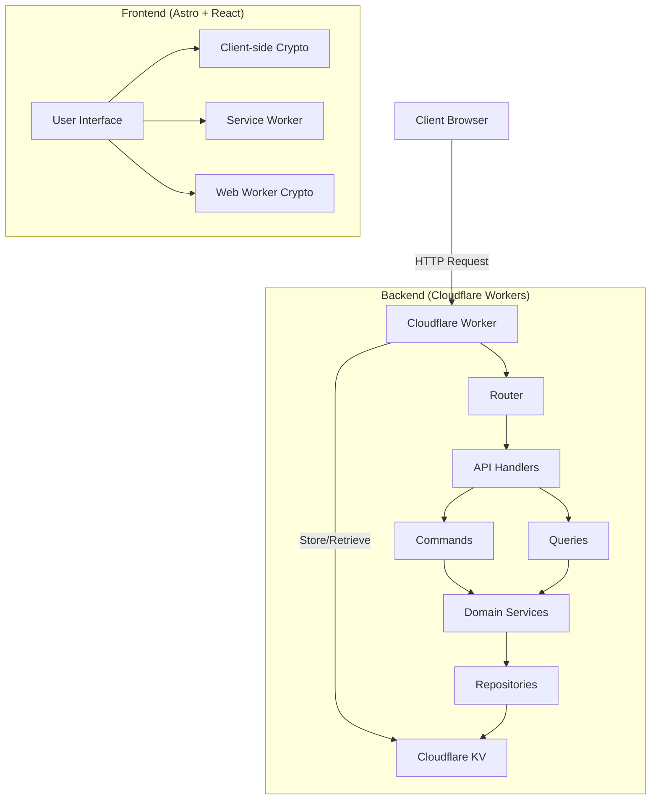
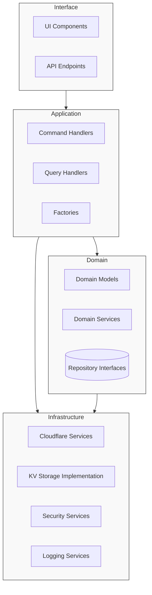
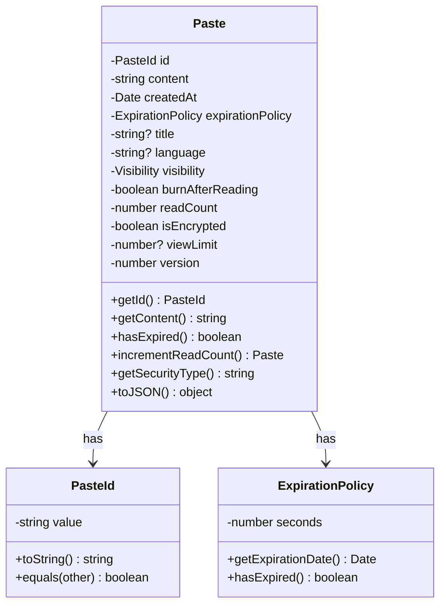
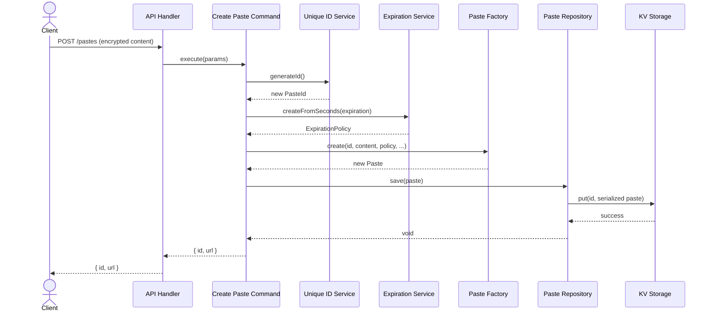
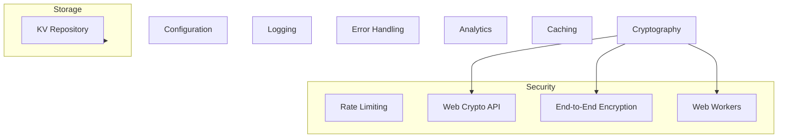
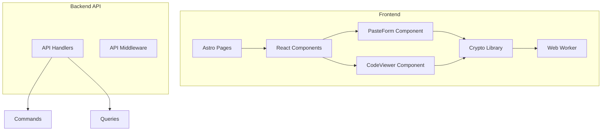
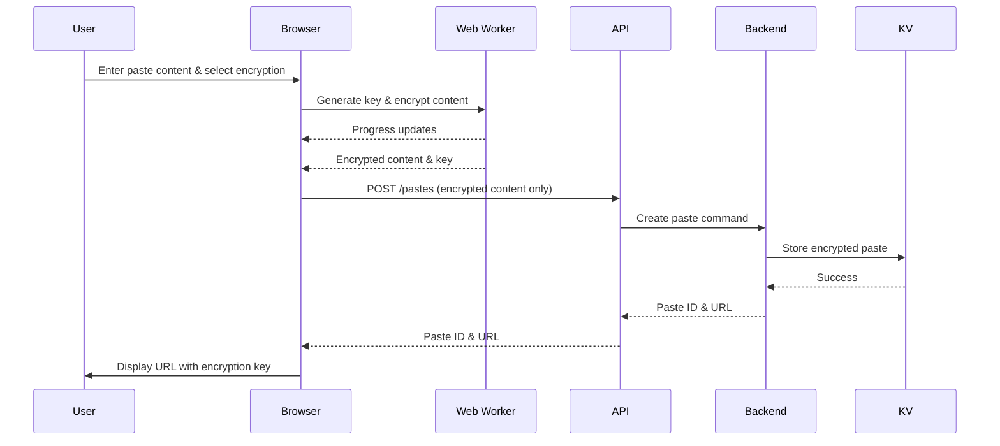
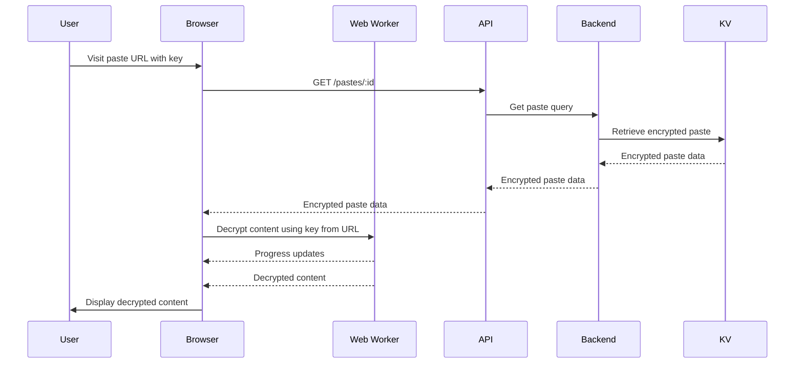

# Pastebin Architecture Documentation

This document provides a detailed overview of the Pasteriser application architecture, which follows Domain-Driven Design (DDD) principles to maintain a clean separation of concerns while providing a secure, performant pastebin service.

## System Overview

Pasteriser is a modern pastebin service with client-side encryption capabilities, built on Cloudflare Workers. The application provides secure content sharing with features like end-to-end encryption, expiration policies, and syntax highlighting.



## Architectural Layers

The application is structured in four primary layers following Domain-Driven Design principles:

1. **Domain Layer**: Core business logic and entities
2. **Application Layer**: Use cases and application orchestration
3. **Infrastructure Layer**: Technical capabilities and external services
4. **Interface Layer**: User interfaces and API endpoints



## Domain Layer

The domain layer contains the core business logic and rules of the application, independent of any external concerns.

### Core Domain Model

The application is centered around the **Paste** concept - a text/code snippet with metadata and security features.



### Core Models

- **Paste**: The central entity representing a user's text/code snippet
  ```typescript
  export class Paste {
    constructor(
      private readonly id: PasteId,
      private readonly content: string,
      private readonly createdAt: Date,
      private readonly expirationPolicy: ExpirationPolicy,
      private readonly title?: string,
      private readonly language?: string,
      private readonly visibility: Visibility = 'public',
      private readonly burnAfterReading: boolean = false,
      private readonly readCount: number = 0,
      private readonly isEncrypted: boolean = false,
      private readonly viewLimit?: number,
      private readonly version: number = 0, // 0=plaintext, 1=server-side, 2=client-side encryption
    ) {}
    
    // Methods for accessing and managing paste data
    getSecurityType(): string {
      if (this.version >= 2 || this.isEncrypted) {
        return 'E2E Encrypted';
      } else {
        return 'Public';
      }
    }
  }
  ```

- **Value Objects**:
  - `PasteId`: Unique identifier for pastes
  - `ExpirationPolicy`: Encapsulates expiration rules
  - `Visibility`: Enum for paste visibility options ("public" or "private")

### Domain Services

- **ExpirationService**: Handles paste expiration policies
- **UniqueIdService**: Generates unique identifiers for pastes

### Repository Interfaces

- **PasteRepository**: Interface for paste storage operations
  ```typescript
  export interface PasteRepository {
    save(paste: Paste): Promise<void>;
    findById(id: PasteId): Promise<Paste | null>;
    delete(id: PasteId): Promise<boolean>;
    findRecentPublic(limit: number): Promise<Paste[]>;
  }
  ```

## Application Layer

The application layer coordinates the domain objects to perform use cases and application logic.



### Commands

- **CreatePasteCommand**: Handles paste creation
  ```typescript
  export class CreatePasteCommand {
    constructor(
      private readonly repository: PasteRepository,
      private readonly idService: UniqueIdService,
      private readonly expirationService: ExpirationService,
      private readonly baseUrl: string,
    ) {}
    
    async execute(params: CreatePasteParams): Promise<CreatePasteResult> {
      // Validate params
      // Generate unique ID
      // Create expiration policy
      // Create paste entity
      // Save to repository
      // Return result with URL
    }
  }
  ```

- **DeletePasteCommand**: Handles paste deletion
  ```typescript
  export class DeletePasteCommand {
    constructor(
      private readonly repository: PasteRepository,
      private readonly logger: Logger,
    ) {}
    
    async execute(id: string): Promise<boolean>
  }
  ```

### Queries

- **GetPasteQuery**: Retrieves pastes by ID
  ```typescript
  export class GetPasteQuery {
    constructor(
      private readonly repository: PasteRepository,
      private readonly logger: Logger,
    ) {}
    
    async execute(id: string): Promise<Paste | null>
    
    // Get paste with security information
    async executeSummary(id: string): Promise<{ 
      paste: Paste, 
      isE2EEncrypted: boolean 
    } | null>
  }
  ```
  
- **GetRecentPastesQuery**: Retrieves recently created public pastes
  ```typescript
  export class GetRecentPastesQuery {
    constructor(private readonly repository: PasteRepository) {}
    
    async execute(limit: number = 10): Promise<Paste[]>
  }
  ```

### Factories

- **PasteFactory**: Creates paste entities from raw data
  ```typescript
  export class PasteFactory {
    static fromData(data: PasteData): Paste {
      // Map raw data to domain entity
      // Handle version compatibility
      return new Paste(/* ... */);
    }
  }
  ```

## Infrastructure Layer

The infrastructure layer implements technical capabilities required by the domain and application layers.



### Storage

- **KVPasteRepository**: Implementation of the PasteRepository using Cloudflare KV
  ```typescript
  export class KVPasteRepository implements PasteRepository {
    constructor(
      private readonly kv: KVNamespace,
      private readonly logger: Logger,
    ) {}
    
    async save(paste: Paste): Promise<void> {
      // Serialize paste to JSON
      // Set TTL based on expiration policy
      // Store in KV with paste ID as key
      // Update recent pastes list if public
    }
    
    async findById(id: PasteId): Promise<Paste | null> {
      // Retrieve from KV by ID
      // Parse JSON to PasteData
      // Convert to Paste entity using factory
    }
    
    // Other implementation methods...
  }
  ```

### Security

- **Client-Side Cryptography**: End-to-end encryption implementation
  ```typescript
  // Web Worker-based encryption for performance
  
  // 1. Worker-based implementation
  export async function encryptData(
    data: string, 
    keyBase64: string, 
    isPasswordDerived = false,
    saltBase64?: string,
    progressCallback?: (progress: { percent: number }) => void
  ): Promise<string> {
    // Use worker for large data, fall back to main thread for small data
    // Report progress for UI feedback
  }
  
  // 2. Feature detection and compatibility
  function detectBrowserCompatibility(): BrowserCompatibility {
    // Check for Web Worker support
    // Check for Web Crypto API
    // Determine if worker can be used
  }
  
  // 3. Worker resource management
  function terminateWorker() {
    // Clean up resources when idle
  }
  ```

- **RateLimit**: Implements request rate limiting
- **AppError**: Centralized error handling

### Logging

- **Logger**: Built on Pino with Cloudflare Workers integration
  ```typescript
  export class Logger {
    constructor(configService: ConfigurationService, env?: Env) {
      // Initialize Pino logger with Cloudflare-specific settings
    }
    
    // Logging methods and context management
  }
  ```

### Configuration

- **ConfigurationService**: Manages application configuration with Zod validation
  ```typescript
  export class ConfigurationService {
    private config: Config;

    constructor(customConfig: Partial<Config> = {}) {
      // Merge default config with custom config
      const mergedConfig = this.mergeConfigs(defaultConfig, customConfig);
      
      // Validate config
      this.config = ConfigSchema.parse(mergedConfig);
    }
    
    // Methods to access configuration
  }
  ```

### Caching

- **CacheControl**: Manages HTTP caching headers

### Analytics

- **Analytics**: Tracks user activity and system events

## Interface Layer

The interface layer handles user interaction with the system.



### API

- **ApiHandlers**: HTTP request handlers for the API
  ```typescript
  export class ApiHandlers {
    constructor(
      private readonly createPasteCommand: CreatePasteCommand,
      private readonly getPasteQuery: GetPasteQuery,
      private readonly getRecentPastesQuery: GetRecentPastesQuery,
      private readonly deletePasteCommand: DeletePasteCommand,
      private readonly configService: ConfigurationService,
      private readonly logger: Logger,
      private readonly env: Env,
    ) {}
    
    // API endpoint handlers
    async handleCreatePaste(request: Request): Promise<Response> {
      // Parse request body
      // Execute create paste command
      // Return response with paste ID and URL
    }
    
    async handleGetPaste(request: Request, params: { id: string }): Promise<Response> {
      // Execute get paste query
      // Handle client-side encrypted content
      // Return response with paste data
    }
    
    // Other handler methods...
  }
  ```

- **ApiMiddleware**: Cross-cutting concerns for API requests (CORS, headers)

### UI

- **Astro Pages**: Server-side rendered pages
  - `index.astro`: Home page with paste creation form
  - `pastes/[id].astro`: Paste viewer page
  - `recent.astro`: Recent pastes listing

- **React Components**: Interactive UI elements with performance optimizations
  
  - **PasteForm**: Form for creating pastes with client-side encryption
    ```typescript
    export default function PasteForm() {
      // State for form data, errors, submission status
      const [isSubmitting, setIsSubmitting] = useState(false);
      const [encryptionProgress, setEncryptionProgress] = useState<number | null>(null);
      
      async function handleSubmit(e: React.FormEvent<HTMLFormElement>) {
        // Client-side validation
        // Client-side encryption with progress reporting
        // Submit encrypted content to API
        // Display result with URL and key
      }
      
      return (
        // Form UI with encryption options
        // Progress indicators for encryption operations
        // Security method selection
      );
    }
    ```
  
  - **CodeViewer**: Syntax-highlighted code display with decryption capabilities
    ```typescript
    export default function CodeViewer({ paste }: { paste: PasteData }) {
      // State for decryption status, progress
      const [decryptionProgress, setDecryptionProgress] = useState<number | null>(null);
      
      useEffect(() => {
        // Attempt to decrypt content if encrypted
        // Handle key from URL fragment
        // Show progress during decryption
      }, [paste]);
      
      return (
        // Viewer UI with syntax highlighting
        // Decryption progress indicators
        // Password entry form if needed
      );
    }
    ```
    
  - **DelayedServiceWorker**: Service worker registration with performance optimization
  - **ExpirationCountdown**: Visual countdown for paste expiration
  - **UI Components**: Reusable UI elements (buttons, cards, modals, etc.)

## Request Flows

### Creating an Encrypted Paste



### Viewing an Encrypted Paste



## Backend Request Flow

1. HTTP request received by Cloudflare Worker
2. Request routed by path pattern in `index.ts`
3. Rate limiting applied if necessary
4. Request handled by appropriate API handler
5. Command/Query executed to perform business logic
6. Repository operations performed against KV storage
7. Response formatted and returned to the client
8. For UI requests, Astro-generated HTML served with client-side JavaScript for interactivity

## Directory Structure

```
├── src/                  # Backend source code
│   ├── domain/           # Core business logic
│   │   ├── models/       # Domain entities and value objects
│   │   ├── repositories/ # Repository interfaces
│   │   └── services/     # Domain services
│   │
│   ├── application/      # Application use cases
│   │   ├── commands/     # Command handlers
│   │   ├── queries/      # Query handlers
│   │   └── factories/    # Object factories
│   │
│   ├── infrastructure/   # Technical capabilities
│   │   ├── analytics/    # Usage tracking
│   │   ├── caching/      # Cache control
│   │   ├── config/       # Configuration management
│   │   ├── errors/       # Error handling
│   │   ├── logging/      # Logging services
│   │   ├── security/     # Security controls
│   │   ├── services/     # Infrastructure services
│   │   └── storage/      # Storage implementations
│   │
│   ├── interfaces/       # User interfaces
│   │   ├── api/          # API handlers and middleware
│   │   └── ui/           # UI components and templates
│   │
│   ├── types.ts          # Type definitions
│   └── index.ts          # Application entry point
│
├── astro/                # Frontend source code (Astro-based)
│   ├── src/              # Frontend source files
│   │   ├── components/   # React components
│   │   │   ├── ui/       # Reusable UI components
│   │   │   ├── CodeViewer.tsx  # Paste viewing component
│   │   │   ├── PasteForm.tsx   # Paste creation form
│   │   │   └── ...       # Other components
│   │   │
│   │   ├── lib/          # Frontend libraries
│   │   │   ├── crypto.ts        # Main crypto interface
│   │   │   ├── crypto-worker.ts # Web Worker implementation
│   │   │   └── ...       # Other utilities
│   │   │
│   │   ├── pages/        # Astro page templates
│   │   │   ├── index.astro       # Home page
│   │   │   ├── pastes/[id].astro # Paste view page
│   │   │   └── ...       # Other pages
│   │   │
│   │   └── styles/       # CSS and style files
│   │
│   ├── public/           # Static assets
│   └── astro.config.mjs  # Astro configuration
├── docs/                 # Documentation
└── wrangler.jsonc        # Cloudflare Workers configuration
```

## Deployment Architecture

The application is deployed as a Cloudflare Worker with the following resources:

- **Worker**: Runs the server-side code
- **KV Namespace**: Stores paste data with TTL-based expiration
- **Assets**: Serves the Astro-generated static files
- **Service Worker**: Enables offline functionality and caching for the PWA
- **Web Workers**: Provides performance optimization for crypto operations in the browser

## Future Architectural Improvements

1. **Shared Web Workers**: Use shared workers for crypto operations across multiple tabs
2. **WebAssembly Crypto**: Use WebAssembly for faster cryptographic operations
3. **Binary File Support**: Add support for encrypted binary file uploads
4. **Enhanced Cache Management**: Improved CDN caching strategies for public pastes
5. **Durable Objects**: Consistency for concurrent operations
6. **Password Strength Enforcement**: Stronger password requirements and feedback
7. **User Accounts**: Optional accounts for paste management
8. **R2 Storage**: For larger paste sizes and binary content
9. **Analytics Dashboard**: Advanced usage statistics with privacy focus
10. **Distributed Tracing**: Enhanced observability
11. **Hardware Key Integration**: Support for WebAuthn/FIDO2 keys