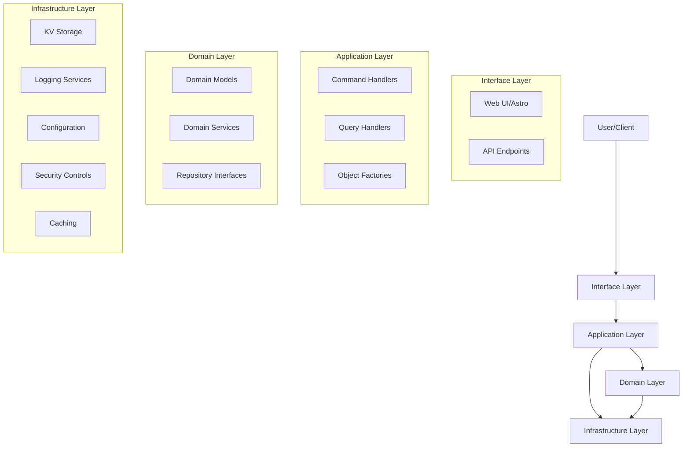
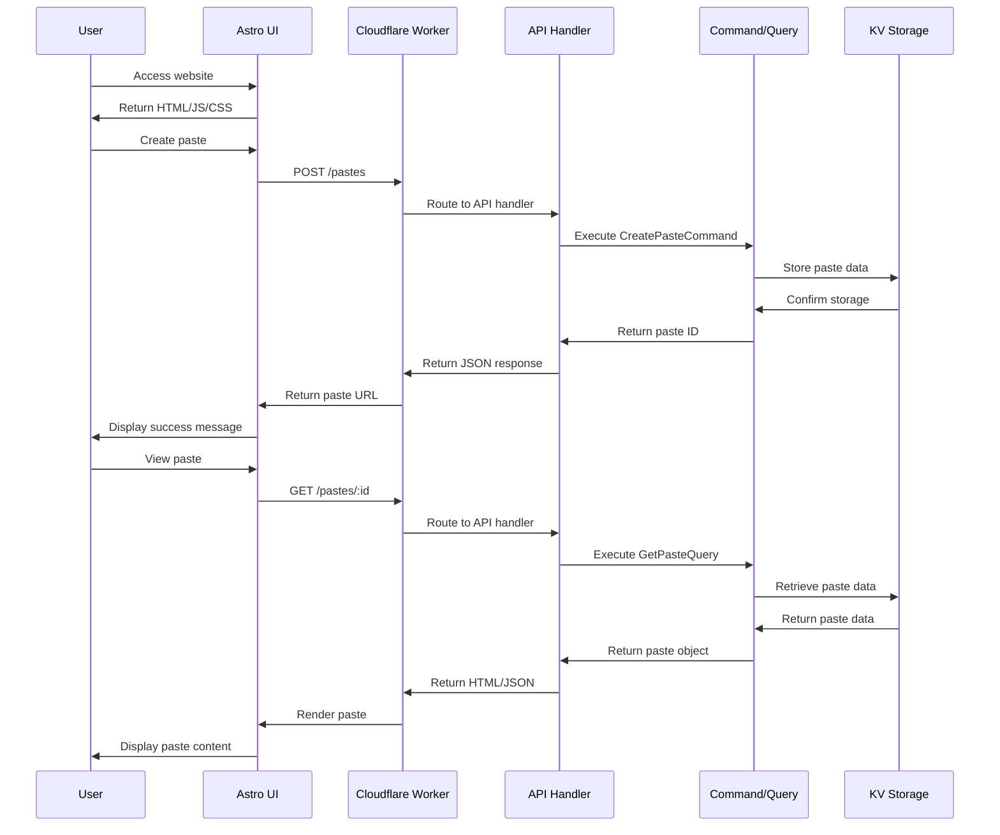
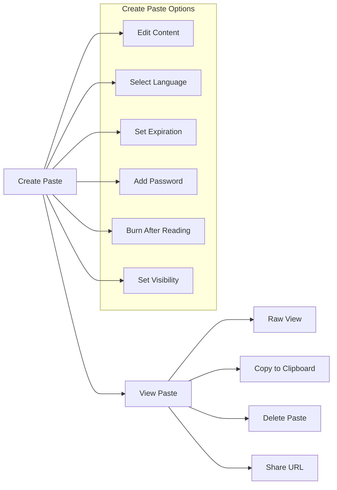
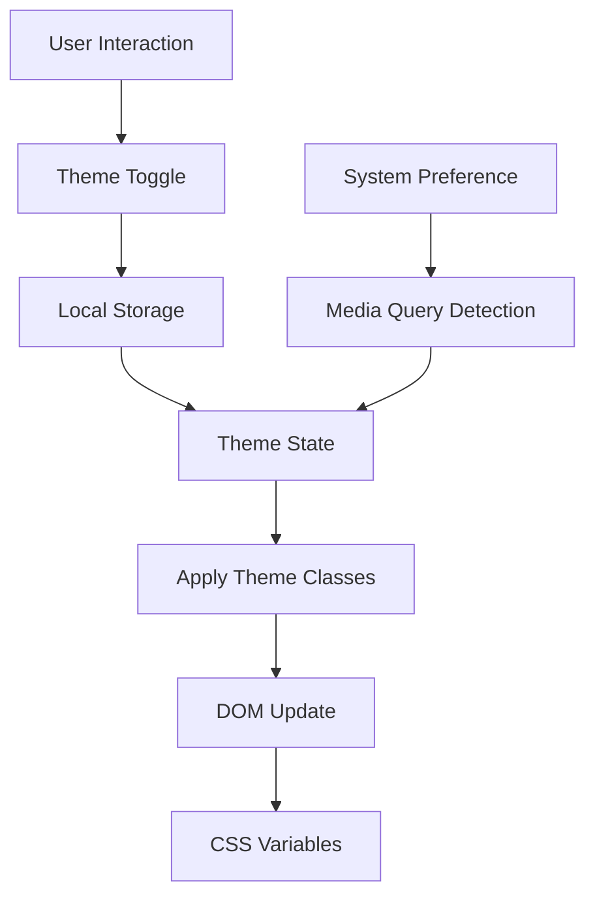
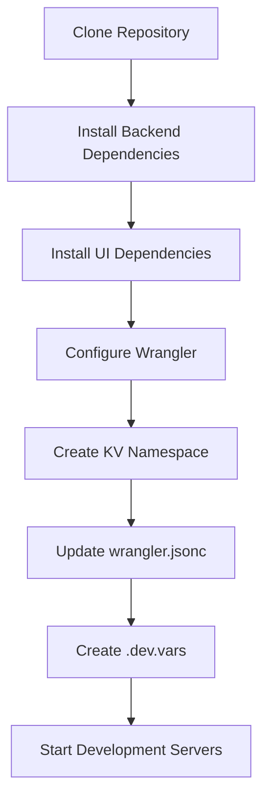
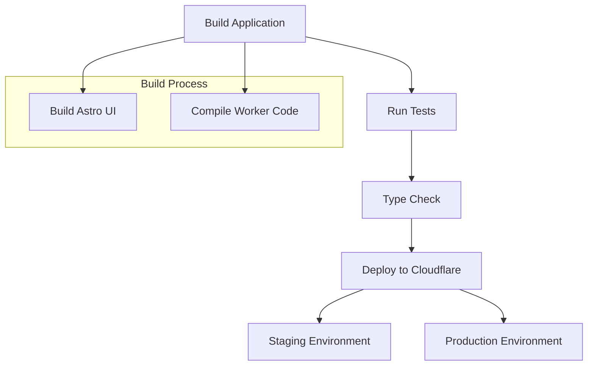

# Pasteriser - Modern Code Sharing Platform

This comprehensive documentation covers all aspects of the Pasteriser application, including architecture, features, API reference, development guidelines, and deployment procedures.

## Table of Contents

- [Introduction](#introduction)
- [Architecture](#architecture)
- [Features](#features)
- [User Interface](#user-interface)
- [Frontend Architecture](./FRONTEND_ARCHITECTURE.md)
- [API Reference](#api-reference)
- [Development Guide](#development-guide)
- [PWA Implementation](#pwa-implementation)
- [Deployment](#deployment)
- [Future Roadmap](#future-roadmap)

## Introduction

Pasteriser is a modern, secure code sharing service built with Cloudflare Workers and Astro. It allows users to share code snippets with syntax highlighting, password protection, expiration settings, and "burn after reading" functionality.

### Key Features

- Syntax highlighting with line numbers for 40+ programming languages
- Password protection for sensitive content
- Burn after reading functionality
- Custom expiration times
- Mobile-responsive design with dark mode support
- Progressive Web App (PWA) capabilities

## Architecture

The application follows Domain-Driven Design (DDD) principles with a clear separation of concerns across four primary layers.



### Domain Layer

The core business logic and rules, independent of external concerns.

- **Models**: `Paste`, `PasteId`, `ExpirationPolicy`, `Visibility`
- **Services**: `ExpirationService`, `UniqueIdService`
- **Repository Interfaces**: `PasteRepository`

### Application Layer

Coordinates domain objects to perform use cases.

- **Commands**: `CreatePasteCommand`, `DeletePasteCommand`
- **Queries**: `GetPasteQuery`, `AccessProtectedPasteQuery`
- **Factories**: `PasteFactory`

### Infrastructure Layer

Implements technical capabilities required by domain and application layers.

- **Storage**: `KVPasteRepository`
- **Logging**: `Logger`
- **Configuration**: `ConfigurationService`
- **Security**: `RateLimit`, `AppError`
- **Caching**: `CacheControl`

### Interface Layer

Handles user interaction with the system.

- **API**: `ApiHandlers`, `ApiMiddleware`
- **UI**: Astro pages, React components

## Request Flow



## Features

### Paste Creation and Management

- **Content Types**: Plain text, code snippets with syntax highlighting
- **Languages**: Support for 40+ programming languages
- **Expiration**: 1 hour, 1 day, 1 week, 30 days, 1 year
- **Security**: Password protection, private visibility
- **Special Options**: Burn after reading functionality

### Security Features

- **Password Protection**: Securely protect pastes with a password
- **Burn After Reading**: Self-destructing pastes that delete after viewing
- **Private Pastes**: Hidden from listings, accessible only via direct URL
- **Rate Limiting**: Protection against abuse
- **Content Validation**: Input validation for all fields

### User Experience



- **Dark Mode**: Full dark mode support with system preference detection
- **Responsive Design**: Mobile-friendly layout
- **Line Numbers**: Displayed for all code snippets
- **Copy to Clipboard**: One-click copy functionality with toast notifications
- **Syntax Highlighting**: Using Prism.js with enhanced themes
- **Toast Notifications**: User-friendly feedback notifications
- **Modal Dialogs**: Improved confirmation dialogs

### Progressive Web App (PWA)

- **Offline Support**: Basic functionality when offline
- **Install to Home Screen**: Add to home screen capability
- **Service Worker**: Caching for improved performance

## User Interface

The user interface is built with Astro and React components, styled with Tailwind CSS for a modern, responsive design. For a detailed breakdown of the frontend architecture, component relationships, and state management, see the [Frontend Architecture](./FRONTEND_ARCHITECTURE.md) documentation.

```mermaid
graph TD
    Layout[Layout.astro] --> Header[Header.tsx]
    Layout --> Footer[Footer.tsx]
    Layout --> ToastContainer[ToastContainer]
    Layout --> Content[Page Content]
    
    Content --> IndexPage[index.astro]
    Content --> PastePage[paste/[id].astro]
    Content --> DeletePage[paste/[id]/delete.astro]
    
    IndexPage --> PasteForm[PasteForm.tsx]
    PastePage --> CodeViewer[CodeViewer.tsx]
    
    Header --> ThemeToggle[ThemeToggle.tsx]
    
    CodeViewer --> Modal[Modal Dialog]
    CodeViewer --> Toast[Toast Notifications]
    
    PasteForm --> UIComponents[UI Components]
    CodeViewer --> UIComponents
    
    subgraph "UI Components"
        Button[Button]
        Card[Card]
        Select[Select]
        Textarea[Textarea]
    end
```

### Components

- **PasteForm**: Form for creating new pastes with validation
- **CodeViewer**: Syntax highlighted code display with Prism.js integration
- **ThemeToggle**: Dark/light mode switching with system preference detection
- **Toast**: Notification system for user feedback
- **Modal**: Confirmation dialog system for important actions
- **Header/Footer**: Navigation and site information components

### Theme System



- **Theme Detection**: Automatic detection of system preferences
- **Theme Persistence**: User preferences stored in localStorage
- **Flash Prevention**: Prevents flash of incorrect theme on page load

## API Reference

### Endpoints

| Method | Endpoint | Description |
|--------|----------|-------------|
| POST | `/pastes` | Create a new paste |
| GET | `/pastes/:id` | Get a paste by ID |
| POST | `/pastes/:id` | Access a password-protected paste |
| GET | `/pastes/raw/:id` | Get raw paste content |
| DELETE | `/pastes/:id/delete` | Delete a paste |

### Create a Paste (POST `/pastes`)

**Request Body:**

```json
{
  "content": "string", // Required: The content of the paste
  "title": "string", // Optional: Title for the paste
  "language": "string", // Optional: Programming language for syntax highlighting
  "expiration": 86400, // Optional: Expiration time in seconds (default: 86400 - 1 day)
  "visibility": "public", // Optional: "public" or "private" (default: "public")
  "password": "string", // Optional: Password to protect the paste
  "burnAfterReading": false // Optional: Whether the paste self-destructs after viewing (default: false)
}
```

**Response:**

```json
{
  "id": "string", // Unique identifier for the paste
  "url": "string", // Full URL to access the paste
  "expiresAt": "string" // ISO timestamp when the paste will expire
}
```

### Get a Paste (GET `/pastes/:id`)

**Headers:**
- `Accept: application/json` (Required for JSON response)

**Response:**

```json
{
  "id": "string",
  "content": "string",
  "title": "string",
  "language": "string",
  "createdAt": "string",
  "expiresAt": "string",
  "visibility": "public",
  "isPasswordProtected": false,
  "burnAfterReading": false
}
```

### Access a Password-Protected Paste (POST `/pastes/:id`)

**Request Body:**

```json
{
  "password": "string" // Required: The password for the paste
}
```

**Response:**
- Same as "Get a Paste" endpoint

### Get Raw Paste Content (GET `/pastes/raw/:id`)

**Response:**
- Plain text content of the paste

### Error Responses

All error responses follow this format:

```json
{
  "error": {
    "code": "string", // Error code
    "message": "string", // Human-readable message
    "details": {} // Optional additional details
  }
}
```

## Development Guide

### Prerequisites

- Node.js (v18+)
- npm or yarn
- Wrangler CLI (`npm install -g wrangler`)
- Cloudflare account

### Setup



1. **Clone and install dependencies:**

```bash
# Clone repository
git clone https://github.com/username/pastebin.git
cd pastebin

# Install backend dependencies
npm install

# Install UI dependencies
cd astro
npm install
cd ..
```

2. **Configure Wrangler:**

```bash
# Create KV namespace
wrangler kv:namespace create PASTES --preview

# Update wrangler.jsonc with the namespace ID
```

3. **Create environment variables:**

```
# .dev.vars example
LOG_LEVEL="debug"
```

### Development Workflow

```bash
# Start both servers (backend and UI)
npm run dev:all

# Backend only
npm run dev

# UI only
npm run dev:ui

# Run tests
npm test

# Type checking
npm run check
```

### File Structure

```
src/
├── domain/            # Core business logic
│   ├── models/        # Domain entities and value objects
│   ├── repositories/  # Repository interfaces
│   └── services/      # Domain services
│
├── application/       # Application use cases
│   ├── commands/      # Command handlers
│   ├── queries/       # Query handlers
│   └── factories/     # Object factories
│
├── infrastructure/    # Technical capabilities
│   ├── analytics/     # Usage tracking
│   ├── caching/       # Cache control
│   ├── config/        # Configuration management
│   ├── errors/        # Error handling
│   ├── logging/       # Logging services
│   ├── security/      # Security controls
│   └── storage/       # Storage implementations
│
├── interfaces/        # User interfaces
│   ├── api/           # API handlers and middleware
│   └── ui/            # UI templates
│
├── index.ts           # Application entry point
└── types.ts           # Type definitions

astro/
├── public/            # Static assets
├── src/
│   ├── components/    # React components
│   │   ├── ui/        # shadcn/ui components 
│   │   └── ...        # Application-specific components
│   ├── layouts/       # Page layouts
│   └── pages/         # Astro pages
│       └── pastes/    # Paste-related pages
├── astro.config.mjs   # Astro configuration
└── tailwind.config.mjs # Tailwind CSS configuration
```

### Coding Guidelines

- **TypeScript**: Use types effectively, avoid `any`, use interfaces
- **Naming**: PascalCase for classes/interfaces, camelCase for methods/variables
- **Error Handling**: Use `AppError` class, consistent error responses
- **Testing**: Unit tests for domain logic, test happy paths and edge cases

## PWA Implementation

The application includes Progressive Web App (PWA) capabilities for enhanced user experience on mobile and desktop devices.

### Features

- **Offline Support**: Basic functionality when offline
- **Installable**: Add to home screen on mobile devices
- **Fast Loading**: Service worker caching for improved performance
- **Responsive**: Works well on all device sizes

### Implementation

1. **Manifest File**: `site.webmanifest` contains app metadata
2. **Service Worker**: Handles caching and offline functionality
3. **Icons**: Various sizes for different platforms and contexts
4. **Offline Page**: Custom offline experience when no connection is available

### Icon Requirements

The following icon files are needed:

1. **android-chrome-192x192.png** (192×192 pixels)
2. **android-chrome-512x512.png** (512×512 pixels)
3. **apple-touch-icon.png** (180×180 pixels)
4. **favicon-32x32.png** (32×32 pixels)
5. **favicon-16x16.png** (16×16 pixels)
6. **favicon.ico** (multi-size: 16×16, 32×32, 48×48)

## Deployment



### Staging Deployment

```bash
npm run deploy:staging
```

### Production Deployment

```bash
npm run deploy:prod
```

### Required Resources

- **Worker**: Runs the server-side code
- **KV Namespace**: Stores paste data with TTL-based expiration
- **Assets**: Serves the Astro-generated static files

## Future Roadmap

### Planned Features

1. **User Accounts**
   - Authentication and authorization
   - User profiles and libraries
   - Social features

2. **Enhanced Collaboration**
   - Real-time collaborative editing
   - Comments and discussions
   - Version history

3. **Advanced UI/UX**
   - Additional themes
   - Customizable code editor
   - Enhanced mobile experience

4. **Administration**
   - Admin dashboard
   - Usage statistics
   - Content moderation

### Technical Improvements

1. **Performance Optimization**
   - Code splitting
   - Worker optimization
   - Advanced caching strategies

2. **Enhanced Security**
   - End-to-end encryption
   - Advanced rate limiting
   - Abuse prevention

3. **Integration**
   - Version control system integration
   - IDE plugins
   - API enhancements

## License

Copyright © 2025 Erfi Anugrah. All rights reserved.