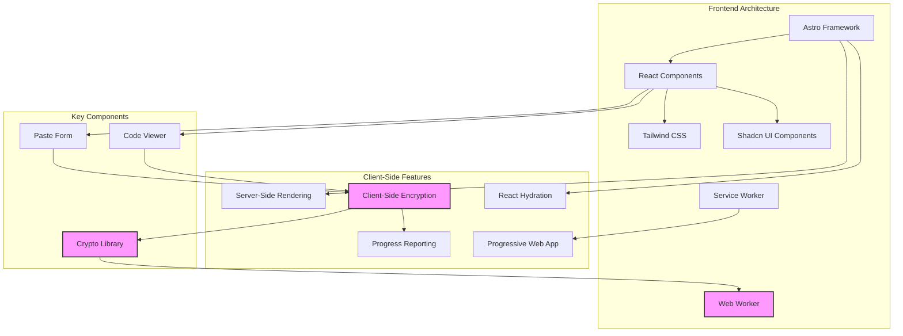
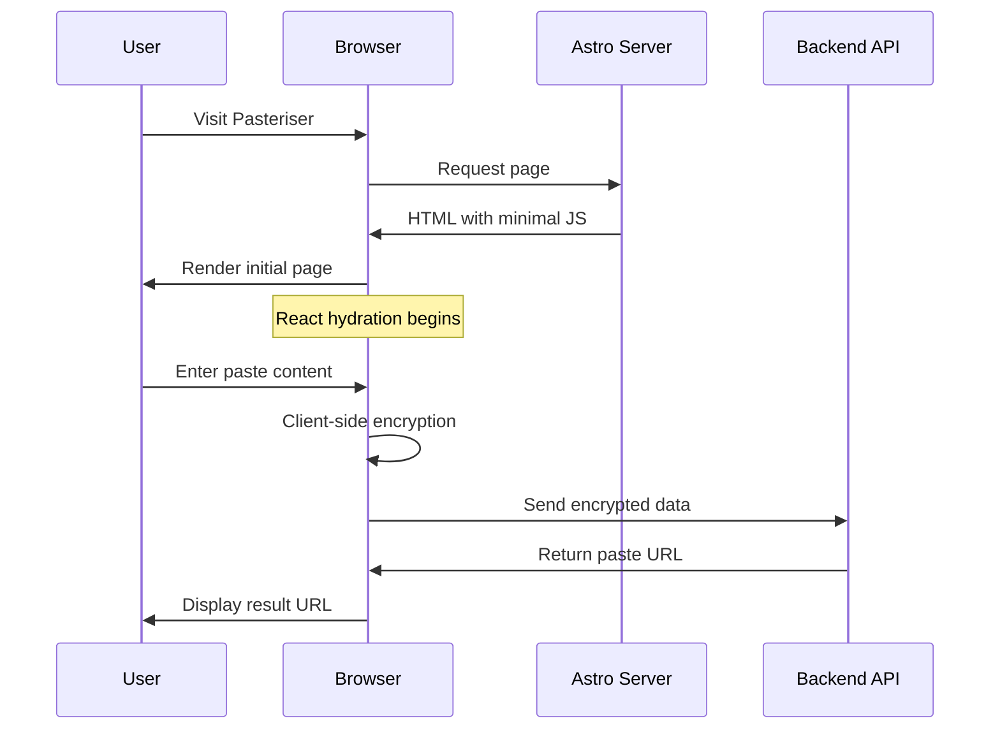
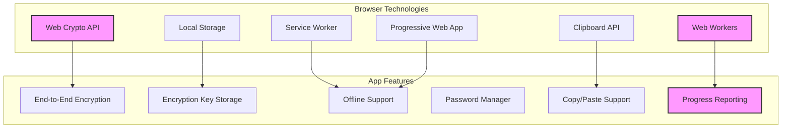
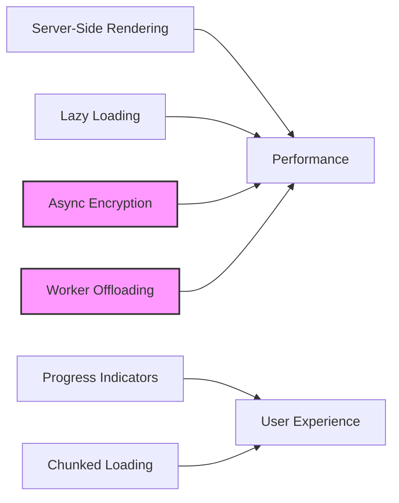
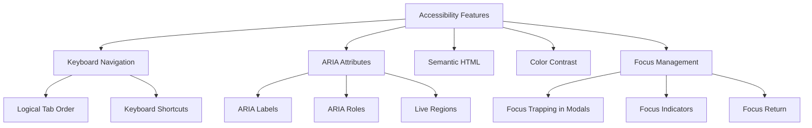

# Pasteriser Frontend Architecture

This document provides a comprehensive overview of the frontend architecture for the Pasteriser application, including the Astro-based UI, React components, browser integration features, and performance optimization strategies.



## Architecture Overview

The Pasteriser frontend is built using Astro as the primary framework, with React for interactive components. This architecture provides several advantages:

1. **Performance**: Astro's partial hydration approach minimizes JavaScript sent to the client
2. **SEO**: Server-side rendering (SSR) for better search engine optimization
3. **Developer Experience**: React components for complex interactive elements
4. **Progressive Enhancement**: Works without JavaScript, enhanced with client-side features
5. **Offline Support**: Service worker integration for Progressive Web App (PWA) capabilities
6. **Security**: Client-side encryption with Web Worker performance optimization



## Key Components

### Page Structure

- **Astro Pages**: Server-side rendered page templates
  - `index.astro`: Home page with paste creation form
  - `pastes/[id].astro`: Dynamic paste view page
  - `recent.astro`: Recent pastes list page
  
- **Layouts**: Reusable page structures
  - `Layout.astro`: Main layout with metadata, navigation, and footer

### React Components

#### Core Functionality

- **PasteForm**: Interactive form for creating new pastes
  ```typescript
  export default function PasteForm() {
    // State for form data, encryption progress, etc.
    const [encryptionProgress, setEncryptionProgress] = useState<number | null>(null);
    
    // Handle form submission with encryption
    async function handleSubmit(e: React.FormEvent<HTMLFormElement>) {
      // Form validation and encryption logic
      // Progress reporting for encryption operations
      // API submission with encrypted content
    }
    
    return (
      // Form UI with encryption options
      // Progress indicators
      // Security method selection
    );
  }
  ```

- **CodeViewer**: Displays pastes with syntax highlighting and decryption
  ```typescript
  export default function CodeViewer({ paste }: { paste: PasteData }) {
    // State for decryption status
    const [decryptionProgress, setDecryptionProgress] = useState<number | null>(null);
    
    // Handle decryption process
    useEffect(() => {
      // Check for encryption key in URL
      // Attempt decryption of encrypted content
      // Report progress during decryption
    }, [paste]);
    
    return (
      // Content display with syntax highlighting
      // Decryption progress indicators
      // Password entry form if needed
    );
  }
  ```

#### Supporting Components

- **DelayedServiceWorker**: Optimized service worker registration
- **ExpirationCountdown**: Visual expiration timer for pastes
- **ThemeToggle**: Light/dark mode switcher
- **Header/Footer**: Site navigation elements
- **UI Components**: Reusable interface elements

### Utility Libraries

- **crypto.ts**: End-to-end encryption implementation
- **crypto-worker.ts**: Web Worker for crypto operations
- **react-hydration.ts**: Utilities for React hydration management
- **utils.ts**: General-purpose helper functions

## Browser Integration Features

Pasteriser implements several browser-specific features to enhance security and user experience:



### Web Worker Cryptography

We use Web Workers to offload cryptographic operations to background threads:

- **Performance Optimization**: CPU-intensive operations run in a separate thread
- **Progress Reporting**: Real-time progress updates for long-running operations
- **Adaptive Processing**: Automatically uses workers for large pastes (>10KB)
- **Resource Management**: Workers are terminated after 60 seconds of inactivity
- **Compatibility Layer**: Falls back to main thread in unsupported browsers

#### Implementation Example

```typescript
// In PasteForm.tsx
const { key: derivedKey, salt } = await deriveKeyFromPassword(
  password,
  undefined,
  (progress) => {
    setEncryptionProgress(Math.floor(progress.percent * 0.3));
  }
);

// In crypto.ts
export async function encryptData(
  data: string, 
  keyBase64: string,
  isPasswordDerived = false,
  saltBase64?: string,
  progressCallback?: (progress: { percent: number }) => void
): Promise<string> {
  // Skip worker for small data
  if (typeof window === 'undefined' || data.length < 10000) {
    return encryptDataMain(data, keyBase64, isPasswordDerived, saltBase64);
  }
  
  // Use worker for large data with progress reporting
  try {
    return await executeInWorker(
      'encrypt', 
      { data, key: keyBase64, isPasswordDerived, salt: saltBase64 },
      progressCallback
    );
  } catch (error) {
    return encryptDataMain(data, keyBase64, isPasswordDerived, saltBase64);
  }
}
```

#### Web Worker Message Protocol

Communication with the worker uses a structured message protocol:

```typescript
// Messages sent to the worker
interface WorkerRequest {
  operation: 'encrypt' | 'decrypt' | 'deriveKey';
  params: EncryptParams | DecryptParams | DeriveKeyParams;
  requestId: string;
}

// Messages received from the worker
interface WorkerResponse {
  success: boolean;
  result?: string;
  error?: string;
  requestId: string;
}

// Progress updates from the worker
interface WorkerProgressUpdate {
  progress: {
    operation: string;
    total: number;
    processed: number;
    percent: number;
    requestId: string;
  };
}
```

This protocol ensures reliable communication and error handling between the main thread and worker threads.

### Password Manager Integration

Users can securely save and auto-fill encryption passwords:

- **Creation Form**: Uses `autocomplete="new-password"` attribute
- **Decryption Form**: Uses `autocomplete="current-password"` attribute
- **Password Storage**: Integrates with browser security features
- **Form Design**: Follows password manager best practices with proper form structure

#### Password Strength Meter

A real-time password strength indicator helps users create secure passwords:

```typescript
// In PasteForm.tsx
const [passwordStrength, setPasswordStrength] = useState<PasswordStrength>({
  score: 0,
  feedback: { warning: '', suggestions: [] }
});

// Update on password change
useEffect(() => {
  if (password.length > 0) {
    const strength = assessPasswordStrength(password);
    setPasswordStrength(strength);
  } else {
    setPasswordStrength({ score: 0, feedback: { warning: '', suggestions: [] } });
  }
}, [password]);
```

The meter provides:
- Visual strength score (0-4)
- Color coding (red, orange, yellow, light green, green)
- Specific feedback and improvement suggestions
- Real-time updates as the user types

### URL Fragment Security

For key-based encryption, we use URL fragments to securely transmit keys:

- **URL Fragment**: Encryption keys are stored in the URL fragment (`#key=...`)
- **Never Transmitted**: Fragments are never sent to the server
- **Share Security**: Users get clear warnings about the security of shared URLs
- **Clipboard Integration**: Special handling for copying sensitive URLs

### Local Key Storage

Secure persistence of encryption keys for return visits:

- **Save Key Button**: Option to store encryption key in localStorage
- **Key Retrieval**: Automatically tries stored keys when revisiting a paste
- **Permission-Based**: Always asks for user consent before storing
- **Error Handling**: Cleans up invalid or expired keys automatically
- **Security Isolation**: Keys stored with paste ID to prevent cross-paste usage

### Clipboard Integration

Enhanced clipboard functionality:

- **Copy URL**: Single-click button to copy the full URL with key
- **Copy Content**: Button to copy decrypted content to clipboard
- **Copy Key Only**: Option to copy just the encryption key
- **Success Confirmation**: Visual feedback when copying succeeds
- **Fallback Instructions**: Manual selection instructions where Clipboard API is unavailable

### Service Worker Integration

Our application uses both Service Workers (for offline capabilities) and Web Workers (for crypto):

- **Offline Access**: Service Workers provide offline access to the application
- **Cache Management**: Crypto libraries are cached for offline use
- **Coordination**: Service Workers and Web Workers operate independently
- **Performance Balance**: Resource management prevents CPU contention between workers
- **Delayed Registration**: Service worker registration is delayed until after initial page load

## Performance Optimization

Pasteriser implements several performance optimizations:



### Core Strategies

1. **Astro Partial Hydration**: Only hydrate interactive components
2. **Web Worker Offloading**: Move CPU-intensive crypto to background threads
3. **Chunked Rendering**: Progressive loading for large pastes
4. **Selective Encryption**: Only use workers for data >10KB
5. **Service Worker Caching**: Offline access and faster repeat visits
6. **React Hydration Optimization**: Delayed React initialization

### Progressive Loading

For large pastes (>5MB), we implement progressive loading:

```typescript
// In CodeViewer.tsx
useEffect(() => {
  const contentToProcess = decrypted ? content : paste.content;
  const isLarge = contentToProcess.length > largeFileThreshold;
  setIsLargeFile(isLarge);
  
  if (isLarge) {
    // Initially show just the first part of the content
    const initialChunkSize = 100 * 1024; // 100KB
    setVisibleContent(contentToProcess.slice(0, initialChunkSize));
    
    // Load the rest of the content after a short delay
    const loadFullContent = () => {
      setVisibleContent(contentToProcess);
      setFullContentLoaded(true);
    };
    
    const timeoutId = setTimeout(loadFullContent, 100);
    return () => clearTimeout(timeoutId);
  } else {
    // For smaller files, show everything immediately
    setVisibleContent(contentToProcess);
    setFullContentLoaded(true);
  }
}, [content, paste.content, decrypted, largeFileThreshold]);
```

### Chunked Cryptographic Processing

For very large pastes, we implement chunked processing to maintain UI responsiveness:

```typescript
// In crypto-worker.ts
async function processLargeData(
  data: string,
  operation: (chunk: string) => Promise<string>,
  chunkSize: number = 100 * 1024, // 100KB chunks
  reportProgress: boolean = false
): Promise<string> {
  const totalSize = data.length;
  let processedSize = 0;
  let result = '';
  
  // Process in chunks
  for (let i = 0; i < totalSize; i += chunkSize) {
    const chunk = data.slice(i, Math.min(i + chunkSize, totalSize));
    const processedChunk = await operation(chunk);
    result += processedChunk;
    
    // Update progress
    processedSize += chunk.length;
    if (reportProgress) {
      self.postMessage({
        progress: {
          total: totalSize,
          processed: processedSize,
          percent: Math.round((processedSize / totalSize) * 100)
        }
      });
    }
    
    // Allow event loop to run
    await new Promise(resolve => setTimeout(resolve, 0));
  }
  
  return result;
}
```

This approach:
- Breaks large data into manageable chunks
- Reports progress after each chunk is processed
- Yields to the event loop to prevent UI blocking
- Adapts chunk size based on device capabilities

### Resource-Aware Processing

We dynamically adjust our processing approach based on device capabilities:

```typescript
// In crypto.ts
function determineOptimalChunkSize(): number {
  // Get device memory if available (Chrome)
  const memory = (navigator as any).deviceMemory || 4; // Default to 4GB
  
  // Base chunk size on available memory
  if (memory <= 1) return 32 * 1024;      // 32KB for low-memory devices
  if (memory <= 2) return 64 * 1024;      // 64KB for medium-memory devices
  if (memory <= 4) return 128 * 1024;     // 128KB for high-memory devices
  return 256 * 1024;                      // 256KB for very high-memory devices
}

// Use optimal chunk size in worker creation
const worker = initializeWorker({
  chunkSize: determineOptimalChunkSize()
});
```

### Worker Lifecycle Management

We carefully manage Web Worker lifecycles to minimize resource usage:

```typescript
// In crypto.ts
// Worker pool management
let workerInstance: Worker | null = null;
let lastWorkerUseTime: number = 0;
const WORKER_IDLE_TIMEOUT = 60000; // 60 seconds

// Create or reuse worker
function getWorker(): Worker {
  if (!workerInstance) {
    workerInstance = new Worker(new URL('./crypto-worker.ts', import.meta.url));
    setupWorkerEventHandlers(workerInstance);
  }
  
  lastWorkerUseTime = Date.now();
  return workerInstance;
}

// Terminate idle workers
function checkAndTerminateIdleWorker() {
  if (workerInstance && Date.now() - lastWorkerUseTime > WORKER_IDLE_TIMEOUT) {
    workerInstance.terminate();
    workerInstance = null;
  }
}

// Set up periodic check for idle workers
setInterval(checkAndTerminateIdleWorker, 30000);

// Ensure workers are terminated on page unload
window.addEventListener('beforeunload', () => {
  if (workerInstance) {
    workerInstance.terminate();
    workerInstance = null;
  }
});
```

### React Hydration Optimization

We optimize React hydration to improve initial load performance:

```typescript
// In react-hydration.ts
export function useDeferredHydration(
  componentId: string,
  delay: number = 100
): boolean {
  const [isHydrated, setIsHydrated] = useState(false);
  
  useEffect(() => {
    // Skip hydration during SSR
    if (typeof window === 'undefined') return;
    
    // Prioritize critical components based on ID
    const priorityDelay = 
      componentId === 'paste-form' ? 0 :
      componentId === 'code-viewer' ? 50 :
      delay;
    
    // Defer hydration
    const timer = setTimeout(() => setIsHydrated(true), priorityDelay);
    return () => clearTimeout(timer);
  }, [componentId, delay]);
  
  return isHydrated;
}
```

This technique:
- Prioritizes critical UI components
- Defers non-essential hydration
- Improves First Contentful Paint (FCP)
- Reduces Time to Interactive (TTI)

### Performance Metrics Tracking

We track key performance metrics to guide optimization efforts:

```typescript
// In performance-monitoring.ts
export function trackCryptoOperationMetrics(
  operation: 'encrypt' | 'decrypt' | 'keyDerivation',
  size: number,
  duration: number,
  useWebWorker: boolean
) {
  // Record metrics
  const metrics = {
    operation,
    size,
    duration,
    useWebWorker,
    timestamp: Date.now(),
    // Calculate operations per second
    opsPerSecond: size / (duration / 1000)
  };
  
  // Log metrics for development
  if (process.env.NODE_ENV === 'development') {
    console.log('Crypto Performance:', metrics);
  }
  
  // Send metrics to analytics in production
  if (process.env.NODE_ENV === 'production') {
    sendAnalyticsEvent('crypto_performance', metrics);
  }
}
```

### Browser Compatibility

Feature support varies by browser with appropriate fallbacks:

| Feature | Chrome/Edge (60+) | Firefox (55+) | Safari (11+) | Opera (47+) | Fallback Behavior |
|---------|------------------|--------------|-------------|------------|-------------------|
| Web Workers | ✅ | ✅ | ✅ | ✅ | Main thread processing |
| Web Crypto API | ✅ | ✅ | ✅ | ✅ | Alert for unsupported browser |
| Service Workers | ✅ | ✅ | ✅* | ✅ | Standard page loading |
| Password Manager | ✅ | ✅ | ✅ | ✅ | Manual password entry |
| LocalStorage | ✅ | ✅ | ✅** | ✅ | No key persistence |
| Clipboard API | ✅ | ✅ | ✅ | ✅ | Manual copy instructions |
| Chunked Processing | ✅ | ✅ | ✅ | ✅ | Single operation |
| Memory Detection | ✅ | ❌ | ❌ | ✅ | Default to 4GB |
| Performance API | ✅ | ✅ | ✅ | ✅ | Basic timing |

*Safari has some limitations with Service Workers in private browsing mode.
**Safari in private browsing mode limits localStorage.

### Mobile Device Optimization

We implement specific optimizations for mobile devices:

- **Reduced Animation**: Disable non-essential animations on low-power devices
- **Viewport Awareness**: Adjust UI elements for smaller screens
- **Touch Interaction**: Larger tap targets and touch-friendly controls
- **Network Detection**: Adapt crypto parameters based on connection quality
- **Battery-Aware Processing**: Reduce processing intensity on low battery
- **Reduced Memory Usage**: Lower chunk sizes on memory-constrained devices

## Accessibility

Pasteriser implements several accessibility features to ensure usability for all users:



### Core Accessibility Features

1. **Semantic HTML Structure**:
   - Using appropriate HTML elements (`<button>`, `<nav>`, `<header>`, etc.)
   - Properly structured headings (`<h1>` through `<h6>`)
   - Meaningful form labels and field associations
   - Landmark regions for navigation

2. **ARIA Implementation**:
   - ARIA roles for complex components
   - ARIA live regions for dynamic content changes
   - ARIA labels and descriptions for clarity
   - Status indicators for operations in progress

3. **Keyboard Navigation**:
   - All interactive elements are keyboard accessible
   - Custom keyboard shortcuts for common actions
   - Focus management for modal dialogs
   - Skip links for keyboard users

4. **Visual Design Considerations**:
   - High contrast color options
   - Text resizing without breaking layouts
   - Visible focus indicators that meet WCAG standards
   - Non-color-dependent status indicators

### Progress Indicators

For long-running cryptographic operations, we ensure accessibility through:

```typescript
// In PasteForm.tsx
function ProgressIndicator({ progress, label }: ProgressProps) {
  return (
    <div className="progress-container">
      <div 
        role="progressbar" 
        aria-valuenow={progress} 
        aria-valuemin={0} 
        aria-valuemax={100}
        aria-label={label}
      >
        <div 
          className="progress-bar" 
          style={{ width: `${progress}%` }} 
        />
      </div>
      <span aria-live="polite">
        {progress < 100 ? `${label}: ${progress}% complete` : 'Complete'}
      </span>
    </div>
  );
}
```

This approach ensures that:
- Screen readers announce progress changes
- Keyboard users can navigate to progress information
- Visual representation is clear and meets contrast requirements
- Status updates are conveyed in multiple ways (visual, textual, and via ARIA)

## Future Enhancements

Based on user feedback and evolving web standards, we plan to implement:

1. **Performance**:
   - Further Web Worker optimizations for progressive enhancements
   - SharedArrayBuffer support for multi-core utilization
   - Advanced chunking strategies based on hardware capabilities
   - Lighter-weight encryption options for performance-critical applications

2. **Browser Integration**:
   - WebAuthn support for biometric authentication
   - Credential Management API integration
   - IndexedDB for more robust encrypted key storage
   - WebAssembly-accelerated encryption libraries

3. **User Experience**:
   - Enhanced mobile device optimization
   - Improved offline support with background sync
   - Progressive loading for extremely large pastes
   - Shared worker implementation for multi-tab performance

4. **Security**:
   - More granular access controls
   - Hardware security key integration
   - Time-based key rotation for longer-lived content
   - Enhanced metadata protection

The architecture is designed with extensibility in mind, allowing these enhancements to be implemented without major refactoring.
