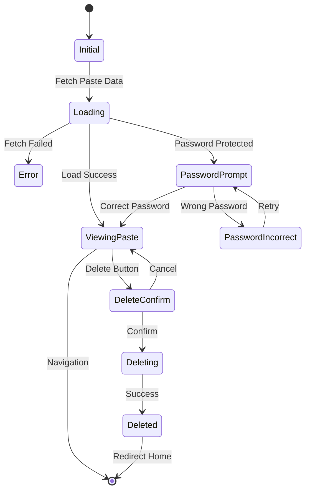
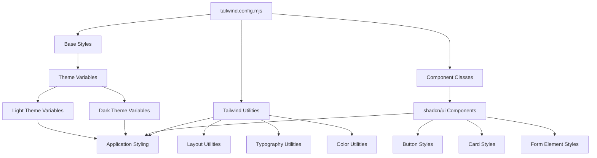

# Frontend Architecture

This document provides a detailed overview of the frontend architecture for the Pasteriser application, built with Astro and React components.

## Component Architecture

The frontend is built using a component-based architecture with Astro for static site generation and React for interactive components. The components are organized into a modular structure that promotes reusability and separation of concerns.

```mermaid
graph TD
    Layout[Layout.astro] --> PageComponents[Page Components]
    Layout --> SharedComponents[Shared Components]
    
    PageComponents --> IndexPage[index.astro]
    PageComponents --> PastePage[pastes/[id].astro]
    PageComponents --> DeletePage[pastes/[id]/delete.astro]
    
    SharedComponents --> Header[Header.tsx]
    SharedComponents --> Footer[Footer.tsx]
    SharedComponents --> Toast[Toast.tsx]
    SharedComponents --> Modal[Modal.tsx]
    
    IndexPage --> PasteForm[PasteForm.tsx]
    PastePage --> CodeViewer[CodeViewer.tsx]
    
    PasteForm --> UIComponents[UI Components]
    CodeViewer --> UIComponents
    Header --> ThemeToggle[ThemeToggle.tsx]
    
    subgraph "UI Components"
        Button[Button.tsx]
        Card[Card.tsx]
        Select[Select.tsx]
        Textarea[Textarea.tsx]
    end
    
    subgraph "Utility Services"
        ThemeService[Theme Service]
        ClipboardService[Clipboard Service]
        NotificationService[Notification Service]
        ValidationService[Validation Service]
    end
    
    PasteForm --> ValidationService
    CodeViewer --> ClipboardService
    ThemeToggle --> ThemeService
    Toast --> NotificationService
```

## Key Components

### Page Components

1. **Layout.astro**: The main layout wrapper that includes:
   - Header/Footer
   - Theme handling
   - Meta tags and SEO
   - Service worker registration
   - Toast notification container

2. **index.astro**: The home page containing:
   - PasteForm component for creating new pastes
   - Basic instructions and information

3. **pastes/[id].astro**: The paste viewing page:
   - Loads paste data from the backend
   - Renders CodeViewer component
   - Handles password protection logic
   - Manages burn-after-reading functionality

4. **pastes/[id]/delete.astro**: The paste deletion page:
   - Initiates deletion requests
   - Provides confirmation and feedback

### Interactive Components

1. **PasteForm.tsx**: Handles paste creation with:
   - Form validation
   - Multiple input fields
   - Syntax language selection
   - Expiration options
   - Password protection
   - Burn after reading toggle

2. **CodeViewer.tsx**: Displays pastes with:
   - Syntax highlighting via Prism.js
   - Line numbers
   - Copy to clipboard functionality
   - Delete confirmation via Modal
   - Toast notifications for user feedback

3. **ThemeToggle.tsx**: Manages theme switching:
   - Light/dark mode options
   - System preference detection
   - Persistent theme storage

4. **Toast.tsx**: Notification system with:
   - Success/error/info states
   - Auto-dismiss functionality
   - Interactive close button
   - Animation effects

5. **Modal.tsx**: Dialog system with:
   - Confirmation/cancel actions
   - Backdrop dismissal
   - Keyboard accessibility (Escape key)
   - Focus trapping

## State Management

The application uses React's built-in state management via:

1. **React Hooks**: useState, useEffect, useRef for component-level state
2. **localStorage**: For persisting theme preferences and user settings
3. **URL Parameters**: For paste IDs and other routing information



## Styling Approach

The styling system uses:

1. **Tailwind CSS**: For utility-based styling
2. **CSS Variables**: For theming (light/dark mode)
3. **shadcn/ui**: For consistent component styling
4. **Global CSS**: For base styles and utilities



## Client-Side Functionality

The application uses client-side JavaScript for:

1. **Theme handling**: Detecting and applying theme preferences
2. **Copy to clipboard**: Providing easy code copying
3. **Password validation**: Handling protected pastes
4. **Toast notifications**: Providing user feedback
5. **Form validation**: Ensuring valid input data
6. **Syntax highlighting**: Applying code highlighting via Prism.js

## Service Worker

The Progressive Web App functionality is powered by a service worker that:

1. **Caches assets**: For faster loading and offline functionality
2. **Handles offline state**: Displays custom offline page
3. **Manages updates**: For seamless application updates
4. **Provides installation**: Enables "Add to Home Screen" functionality

## Performance Optimizations

The frontend implements several performance optimizations:

1. **Astro's partial hydration**: Only interactive components use JavaScript
2. **Code splitting**: Only necessary code is loaded when needed
3. **Asset optimization**: Images and other assets are optimized
4. **Font loading strategy**: Efficient font loading to prevent layout shifts
5. **Lazy loading**: Components load only when needed

## Accessibility Considerations

The application maintains accessibility through:

1. **Semantic HTML**: Using appropriate HTML elements
2. **ARIA attributes**: For improved screen reader support
3. **Keyboard navigation**: All interactive elements are keyboard accessible
4. **Color contrast**: Ensuring sufficient contrast ratios
5. **Focus management**: Proper focus handling for modals and interactive elements