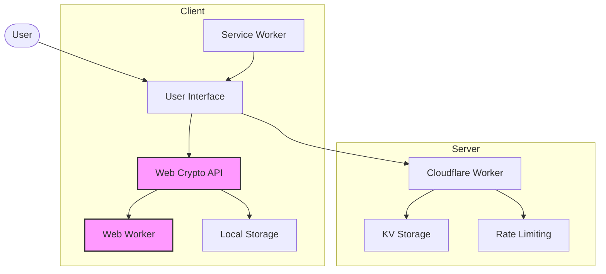
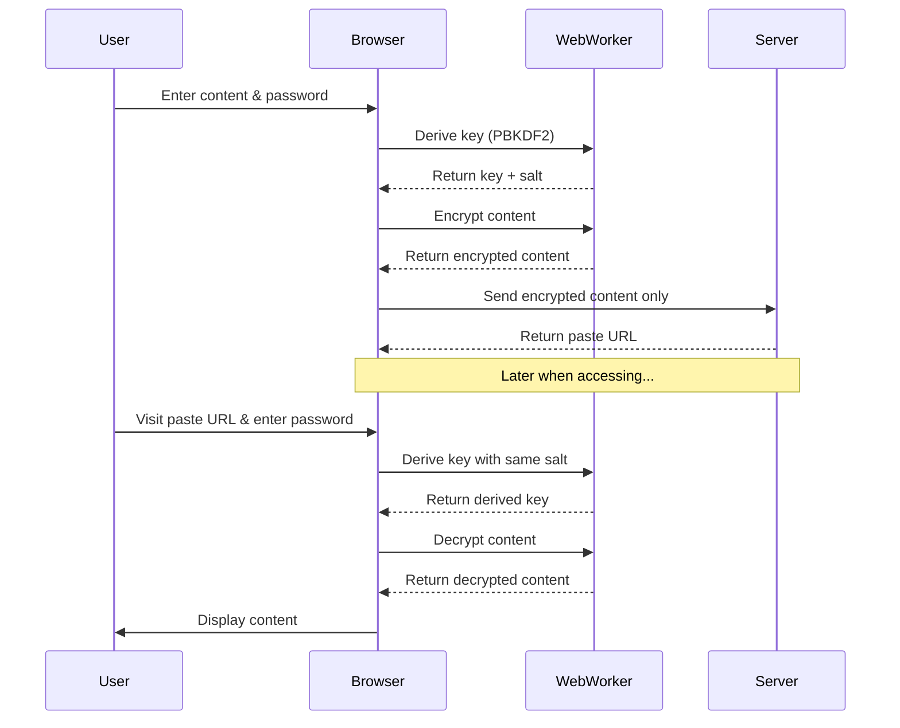
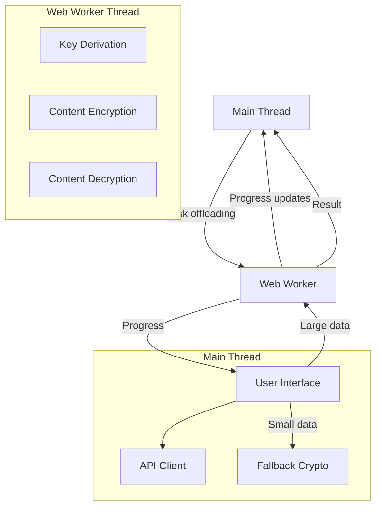
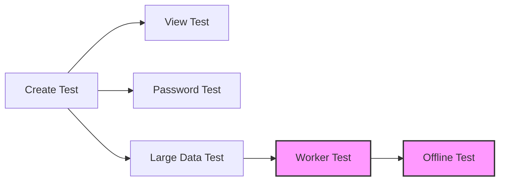

# Security Architecture in Pasteriser

This document provides a comprehensive overview of the security architecture in Pasteriser, our secure pastebin service. We use client-side encryption and modern web security practices to ensure data privacy and protection.



## Overview

Pasteriser implements true end-to-end encryption (E2EE) with high-performance Web Worker-based cryptography. All encryption and decryption happens in the user's browser, not on the server, providing strong privacy guarantees:

1. The server never sees the unencrypted content
2. The server never receives the encryption password or key
3. Only users with the correct password or full URL (containing the key) can decrypt the content
4. Cryptographic operations run in a separate thread for optimal performance
5. All security-related code is open source and auditable



## Security Features

### Encryption Method

We use the following encryption standards:

- **Symmetric Encryption**: XSalsa20-Poly1305 via TweetNaCl.js (`nacl.secretbox`)
- **Key Derivation**: PBKDF2 via Web Crypto API with 300,000 iterations for password-based encryption
- **Random Generation**: Cryptographically secure random number generation for keys, nonces, and salts

### Two Security Options

When creating a paste, users can choose between two security methods:

1. **Password Protection (E2EE)**:
   - A user-supplied password is used to derive an encryption key via PBKDF2
   - A unique random salt is generated for each paste
   - The content is encrypted with the derived key
   - The encrypted content includes the salt so it can be decrypted later
   - The server never receives the password

2. **Key Protection (E2EE)**:
   - A random 32-byte encryption key is generated
   - The content is encrypted with this key
   - The key is appended to the URL fragment (after the # symbol)
   - URL fragments are never sent to the server
   - Only people with the complete URL can decrypt the content

## Technical Implementation

### Encryption Process

1. **Key Generation**:
   - For password-based encryption: PBKDF2 with 300,000 iterations of SHA-256
   - For key-based encryption: Cryptographically random 32-byte key

2. **Content Encryption**:
   - Generate a random 24-byte nonce
   - Encrypt the content using XSalsa20-Poly1305 with the key and nonce
   - For password protection: Combine `[salt + nonce + ciphertext]`
   - For key protection: Combine `[nonce + ciphertext]`
   - Encode the result as Base64 for transmission

### Decryption Process

1. **Key Retrieval**:
   - For password protection: User enters password, combined with extracted salt to derive the key
   - For key protection: Key is extracted from the URL fragment

2. **Content Decryption**:
   - Parse the encrypted data to extract nonce and ciphertext (and salt if password-protected)
   - Decrypt using XSalsa20-Poly1305 with the key and nonce
   - Display the decrypted content

## Security Considerations

- **No Trust Required**: The server has zero knowledge of the content
- **Forward Secrecy**: Each paste uses a unique key or salt
- **Safe Against Database Breaches**: Encrypted content is useless without the key or password
- **URL Security**: Encryption keys in URL fragments are never sent to the server but may be stored in browser history
- **Password Strength**: For password-protected pastes, security depends on password strength
- **Transport Security**: All communications use HTTPS for secure transit

## Implementation Details

Key crypto functions are implemented in `crypto.ts`:

- `generateEncryptionKey()`: Creates a random encryption key
- `deriveKeyFromPassword(password, salt?, progressCallback?)`: Uses PBKDF2 to derive a secure key
- `encryptData(data, key, isPasswordDerived?, salt?, progressCallback?)`: Encrypts data with appropriate formatting
- `decryptData(encrypted, keyOrPassword, isPasswordProtected?, progressCallback?)`: Decrypts data based on method

### Web Worker Optimization

For improved performance, we've implemented a Web Worker system to offload cryptographic operations:



#### Performance Benefits
- Prevents UI freezing during heavy cryptographic operations
- Provides responsive feedback via progress reporting
- Optimizes CPU utilization on multi-core systems
- Significantly improves user experience with large pastes

#### Implementation Features
- **Selective Offloading**: Only pastes larger than 10KB use worker threads
- **Progress Reporting**: Real-time progress indicators during operations
- **Resource Management**: Workers are terminated after 60 seconds of inactivity
- **Graceful Degradation**: Falls back to main thread if Web Workers are unavailable
- **Chunked Processing**: Large data is processed in manageable chunks

#### Technical Implementation
```typescript
// Sample code showing worker task delegation
async function encryptData(
  data: string, 
  keyBase64: string, 
  isPasswordDerived = false, 
  saltBase64?: string,
  progressCallback?: (progress: { percent: number }) => void
): Promise<string> {
  // Skip worker for small data
  if (typeof window === 'undefined' || data.length < 10000) {
    return encryptDataMain(data, keyBase64, isPasswordDerived, saltBase64);
  }
  
  // Use the worker for large data
  try {
    return await executeInWorker(
      'encrypt', 
      { data, key: keyBase64, isPasswordDerived, salt: saltBase64 },
      progressCallback
    );
  } catch (error) {
    // Fall back to main thread on error
    return encryptDataMain(data, keyBase64, isPasswordDerived, saltBase64);
  }
}
```

#### Browser Compatibility
- Automatically detects browser capabilities
- Adapts based on available features (Web Workers, Web Crypto API)
- Falls back to main thread for server-side rendering or older browsers
- Compatible with all modern browsers (Chrome, Firefox, Safari, Edge)

## Testing Security Features

### Basic Encryption Workflow Tests



#### Creating and Viewing Encrypted Pastes

1. **Create Encrypted Paste Test**:
   - Create a new paste with E2E encryption
   - Verify encrypted content is sent to server
   - Check URL contains encryption key fragment
   - Confirm no plaintext data in network requests

2. **View Encrypted Paste Test**:
   - Open paste URL with encryption key
   - Verify automatic decryption occurs
   - Check decrypted content matches original
   - Confirm no key is sent to server

#### Password-Based Encryption Tests

1. **Password Strength Test**:
   - Test various password strengths
   - Verify feedback on weak passwords
   - Check PBKDF2 iteration count (300,000)
   
2. **Password Decryption Test**:
   - Create paste with password protection
   - Visit paste URL without key fragment
   - Enter correct and incorrect passwords
   - Verify error handling for wrong passwords

#### Web Worker Performance Tests

1. **Large Paste Performance Test**:
   - Create paste with >1MB of content
   - Monitor CPU usage during encryption
   - Verify UI remains responsive
   - Check progress bar updates properly

2. **Worker Fallback Test**:
   - Disable Web Workers in browser
   - Encrypt and decrypt content
   - Verify operations still succeed
   - Check console for fallback messages

3. **Service Worker Integration Test**:
   - Enable offline mode
   - Attempt to decrypt previously viewed paste
   - Verify crypto operations work offline
   - Check proper coordination between workers

## Future Enhancements

Planned security improvements include:

1. ✅ Password strength requirements and feedback
2. ✅ Web Worker optimization for heavy cryptographic operations
3. WebAssembly crypto modules for even better performance
4. Hardware security key (WebAuthn) integration
5. Shared Web Workers for multi-tab efficiency
6. Content signing for verification of author
7. Metadata encryption for total privacy
8. Support for file attachments with encryption
9. Enhanced content storage isolation
10. Granular access controls and expiration options

## Version Compatibility

The application supports three encryption versions:

| Version | Type | Status | Description |
|---------|------|--------|-------------|
| 0 | None | Active | Plaintext content, no encryption |
| 1 | Server-side | Deprecated | Server verifies password, not truly E2E |
| 2 | Client-side | Active | Full E2E encryption, server never sees plaintext |

For maximum security, all content should use version 2 (client-side E2E encryption).